# My notes on "Terraform in Action" by Scott Winkler

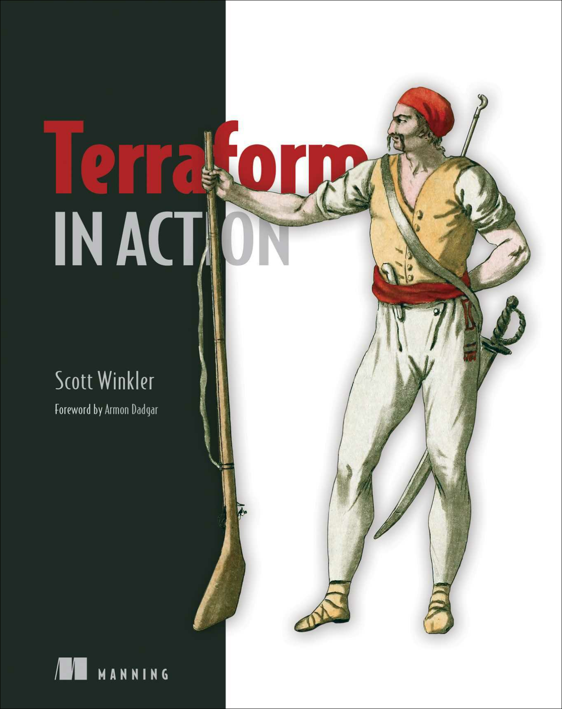

<details>
<summary>Book Resources</summary>

- [Book Code](https://github.com/terraform-in-action/manning-code)

</details>

<!-- omit from toc -->
## Helpful Commands

```cmd
terraform init      # Initialize a working directory containing Terraform configuration files
terraform apply     # Create or update infrastructure as defined in the configuration files
terraform show      # Show the current state of the infrastructure managed by Terraform
```

<!-- omit from toc -->
## Terraform Resources
- [Install Terraform](https://developer.hashicorp.com/terraform/tutorials/aws-get-started/install-cli)

<!-- omit from toc -->
## Contents

- [Part 1: Terraform Bootcamp](#part-1-terraform-bootcamp)
  - [Chapter 1: Getting Started with Terraform](#chapter-1-getting-started-with-terraform)
    - [1.2 Hello Terraform Example](#12-hello-terraform-example)
      - [1.2.1 Writing the Configuration](#121-writing-the-configuration)
      - [1.2.2 Configuring the AWS Provider](#122-configuring-the-aws-provider)
      - [1.2.3 Initializing Terraform](#123-initializing-terraform)
      - [1.2.4 Deploying the EC2 Instance](#124-deploying-the-ec2-instance)
      - [1.2.5 Destroying the EC2 Instance](#125-destroying-the-ec2-instance)
    - [1.3 Brave new "Hello Terraform"](#13-brave-new-hello-terraform)
  - [Chapter 2: Life Cycle of a Terraform Resource](#chapter-2-life-cycle-of-a-terraform-resource)
    - [2.1 Process Overview](#21-process-overview)
    - [2.1.1 Life cycle function hooks](#211-life-cycle-function-hooks)
    - [2.2 Declaring a local file resource](#22-declaring-a-local-file-resource)
    - [2.3 Initializing the workspace](#23-initializing-the-workspace)
    - [2.4 Generating an execution plan](#24-generating-an-execution-plan)
      - [Enabling Trace Logging](#enabling-trace-logging)
      - [Troubleshooting slow-running plans](#troubleshooting-slow-running-plans)
      - [Stages of `terraform plan`](#stages-of-terraform-plan)
      - [Generating a dependency graph](#generating-a-dependency-graph)
      - [Inspecting the plan using JSON](#inspecting-the-plan-using-json)
    - [2.5 Creating the local file resource](#25-creating-the-local-file-resource)
    - [2.6 Performing No-Op](#26-performing-no-op)
    - [2.7 Updating the local file resource](#27-updating-the-local-file-resource)
      - [2.7.1 Detecting configuration drift](#271-detecting-configuration-drift)
      - [Terraform refresh](#terraform-refresh)
    - [2.8 Deleting the local file resource](#28-deleting-the-local-file-resource)
  - [Chapter 3: Functional Programming](#chapter-3-functional-programming)
    - [3.1 Fun with Mad Libs](#31-fun-with-mad-libs)
      - [3.1.1 Input Variables](#311-input-variables)
      - [3.1.2 Assigning values with a variable definition file](#312-assigning-values-with-a-variable-definition-file)
      - [3.1.3 Validating variables](#313-validating-variables)
      - [3.1.4 Shuffling lists](#314-shuffling-lists)
      - [3.1.5 Functions](#315-functions)


## Part 1: Terraform Bootcamp

### Chapter 1: Getting Started with Terraform

#### 1.2 Hello Terraform Example

**Scenario**: Use Terraform to deploy a virtual machine (EC2 instance) on AWS.


The sequence of steps to deploy the EC2 instance using Terraform:


##### 1.2.1 Writing the Configuration

The HashiCorp Configuration Language (HCL)  is used to declare an aws_instance resource in a Terraform configuration file. The configuration file is a text file with a `.tf` extension. The file contains the following code:
```hcl
resource "aws_instance" "helloworld" {
  ami           = "ami-09dd2e08d601bff67"
  instance_type = "t2.micro"
  tags = {
    Name = "HelloWorld"
  }
}
```
The first line declares a resource and exactly two labels, the first is the type of resource (aws_instance) and the second is a name for the resource (helloworld). Together the type and name form a unique identifier for the resource.


The remaining lines of the resource block are called arguments.


##### 1.2.2 Configuring the AWS Provider

Providers can be either `aws`, `azurerm`, or `google`. 

```hcl
provider "aws" {
    region = "us-west-2"
}

resource "aws_instance" "helloworld" {
  ami           = "ami-09dd2e08d601bff67"
  instance_type = "t2.micro"
  tags = {
    Name = "HelloWorld"
  }
}
```
Things to note:
- Providers only have inputs, no outputs.


##### 1.2.3 Initializing Terraform

Run `terraform init` to initialize Terraform and download the AWS provider plugin:  
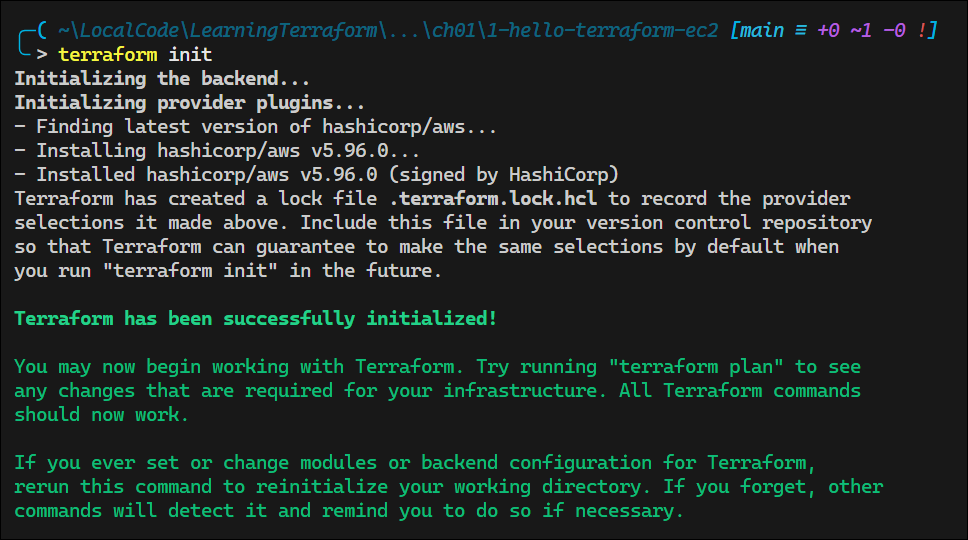

##### 1.2.4 Deploying the EC2 Instance

Run `terraform apply` to create the EC2 instance. Terraform will prompt for confirmation before proceeding with the deployment. After confirming, Terraform will create the EC2 instance and display the output.

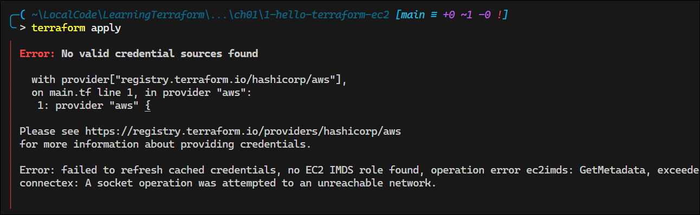

After configuring AWS credentials...

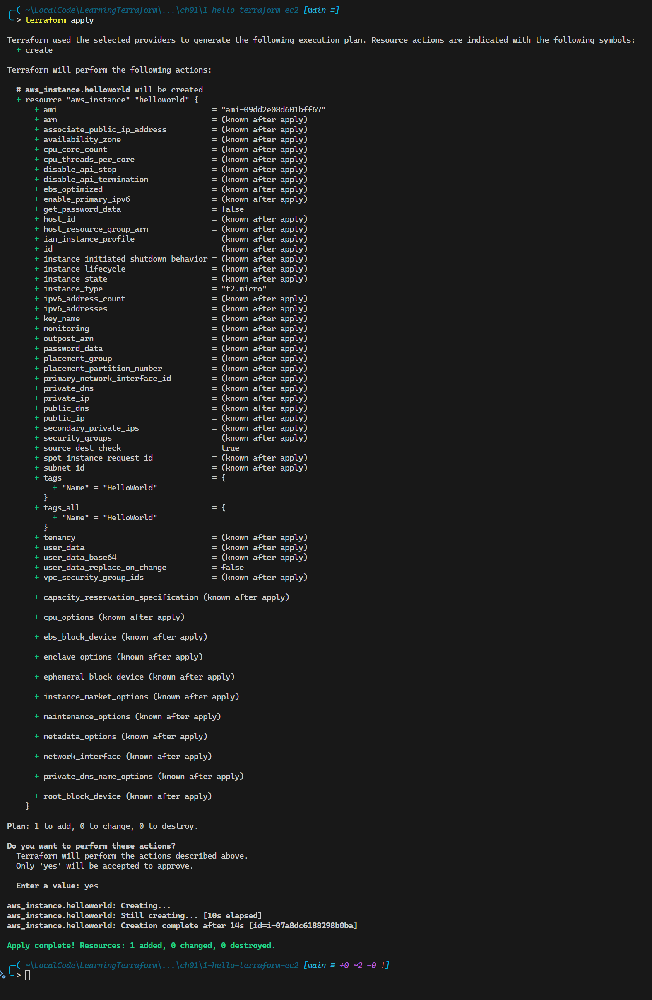

Confirm resource creation: 


Information about the created resource is stored in the Terraform state file with the `.tfstate` extension:

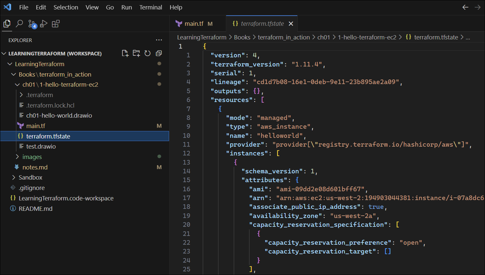

> IMPORTANT: Do not manuaually edit or delete the `.tfstate` file. Terraform uses this file to keep track of the resources it manages. If you edit or delete it, Terraform may lose track of the resources and cause issues in future operations.

Use `terraform show` to display the current state of the infrastructure managed by Terraform. This command will show the details of the EC2 instance created in the previous step.

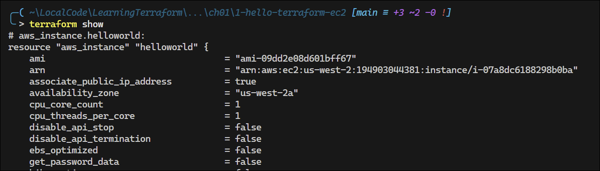

##### 1.2.5 Destroying the EC2 Instance

Run `terraform destroy` to remove the EC2 instance created in the previous step. 

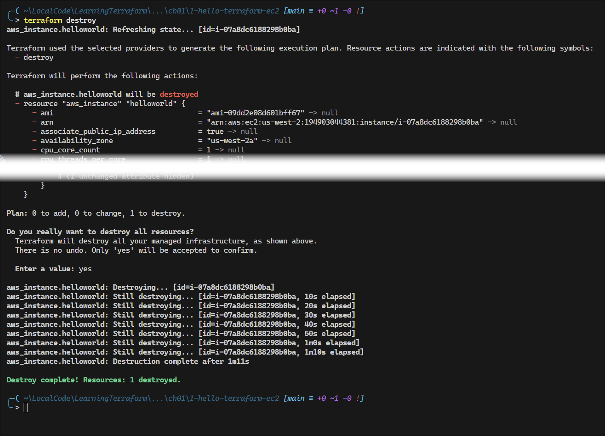

#### 1.3 Brave new "Hello Terraform"

Terraform can also provision resources dynamically based on the results of external queries and data lookups.

*Data sources* are elements that allow you to fetch data at runtime and perform computations.

In the following example, we pass the output value into `aws_instance` so that we don't have to statically set the AMI in the EC2 instance resource configuration.


```hcl
provider "aws" {
    profile = "tf-user"
    region = "us-west-2"
}

# Data sources are declared having exactly two labels
# The type, "aws_ami", and name, "ubuntu", must be unique within the module
data "aws_ami" "ubuntu" {
    most_recent = true
    filter {
        name = "name"
        values = ["ubuntu/images/hvm-ssd/ubuntu-focal-20.04-amd64-server-*"]
    }
    owners = ["099720109477"]       # Represents the owner of the AMI, in this case, Canonical
}

# Resources are declared having exactly two labels
resource "aws_instance" "helloworld" {
  ami           = data.aws_ami.ubuntu.id
  instance_type = "t2.micro"
  tags          = {
    Name = "HelloWorld"
  }
}
```

Use the following commands to create, show, and destroy the EC2 instance:

```powershell
terraform apply         # Create the EC2 instance
terraform show          # Show the current state of the infrastructure
terraform destroy       # Remove the EC2 instance
```
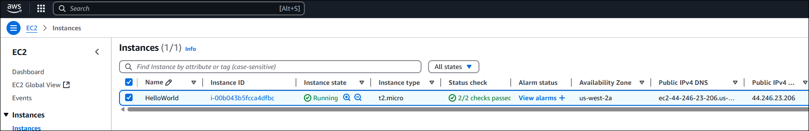


### Chapter 2: Life Cycle of a Terraform Resource

Fundamentally, Terraform is a state operation tool that performs CRUD operations on managed resources.

Terraform has *local-only resources* that exist only within the confines of Terraform or the machine running Terraform. These resources are not managed by any provider and are not created or destroyed in the cloud. They are used to manage local state and configuration.

Examples include reosurces for creating private keys, self-signed certificates,  and random ids.

#### 2.1 Process Overview

We will use the `local_file` resource from the `Local` provider to create, read, update, and delete a text file.


Here's a look at the workflow:


#### 2.1.1 Life cycle function hooks

All Terraform resources implement the resource schema interface. This schema mandates CRUD function hooks, one each for `Create()`, `Read()`, `Update()`, and `Delete()` operations. 

Because it's a resource, `local_file` also implements this interface.


#### 2.2 Declaring a local file resource

```hcl
terraform {
    required_version = ">= 0.15"
    required_providers {
        local = {
            source = "hashicorp/local"
            version = "~> 2.0"
        }
    }
}

resource "local_file" "literature" {
    filename = "art_of_war.txt"
    content  = <<-EOT
        Sun Tzu said: The art of war is of vital importance to the State.

        It is a matter of life and death, a road either to safety or to
        ruin. Hence it is a subject of inquiry which can on no account be
        neglected.
    EOT
}

```
**Note:**  
- The `terrraform` block configures Terraform. Its primary use is version-locking your code, but it can also configure where your state file is stored and where providers are downloaded.
- The second configuration block declares a `local_file` resource and stores text in a file called `art_of_war.txt`. 
- The `<<-EOT` syntax is called *heredoc* and allows you to write multi-line strings. The `EOT` at the end of the block indicates the end of the heredoc. The leading whitespace is ignored.

#### 2.3 Initializing the workspace

Terraform configuration must always be initialized at least once, but you may have to initialize again if you add new providers or modules.

```cmd
terraform init
```
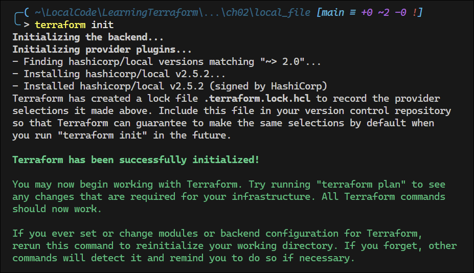

Note that Terraform creates a hidden directory for installing plugins and modules:

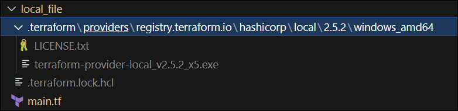

**Tip:** version lock any providers you use to ensure deployments are repeatable.

```hcl
terraform {
    required_version = ">= 0.15"
    required_providers {
        local = {
            source = "hashicorp/local"
            version = "~> 2.0"
        }
    }
}
```

Lockfile: 

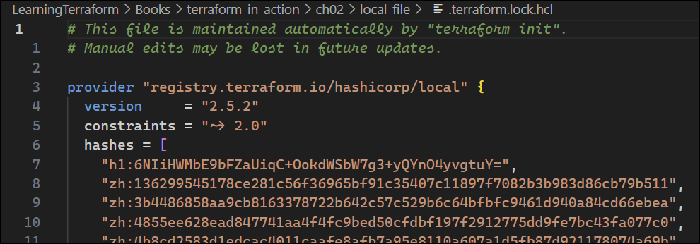

#### 2.4 Generating an execution plan

Always run `terraform plan` before deploying.

```cmd
terraform plan
```
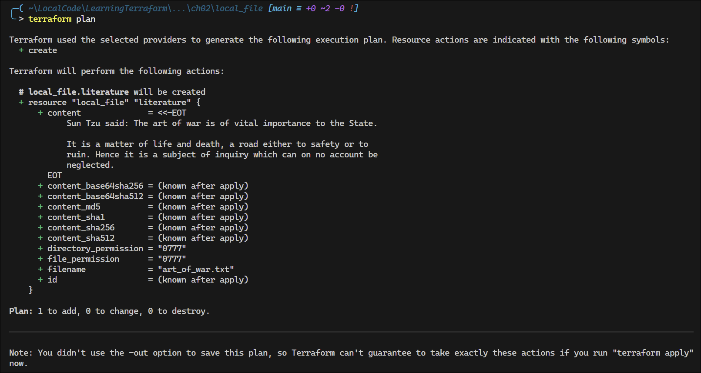

##### Enabling Trace Logging

Plans can fail for many reasons. For verbose logs, you can turn on trace-level logging by setting the `TF_LOG` environment variable to a non-zero value, e.g. `TF_LOG=TRACE`. 

```powershell
$env:TF_LOG = 'TRACE'       # Other options: DEBUG, INFO, WARN, ERROR
$env:TF_LOG_PATH = ".\terraform.log"
```
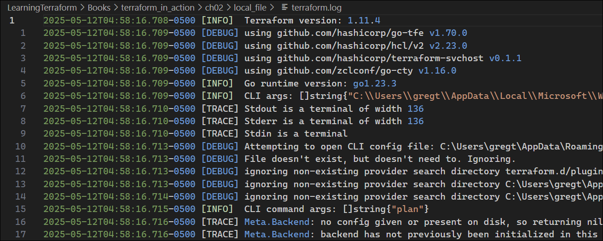

##### Troubleshooting slow-running plans

Turn off trace logging and consider increasing parallelism.

```cmd
terraform plan -parallelism=50
```
By default, Terraform uses a parallelism of 10. Note that too high of a parallelism can cause failures like API throttling.

`terraform apply` will need similar tuning.

##### Stages of `terraform plan`

Three main stages:
1. Read the configuration and state.
2. Determine the actions to take.
3. Output the plan.


##### Generating a dependency graph

Use `terraform graph` to generate a dependency graph for visualizing the relationships between resources. 

```
terraform graph -type=plan > graph.dot
terraform graph -type=apply > graph.dot
```
**Example:** from `terraform graph -type=plan`:  
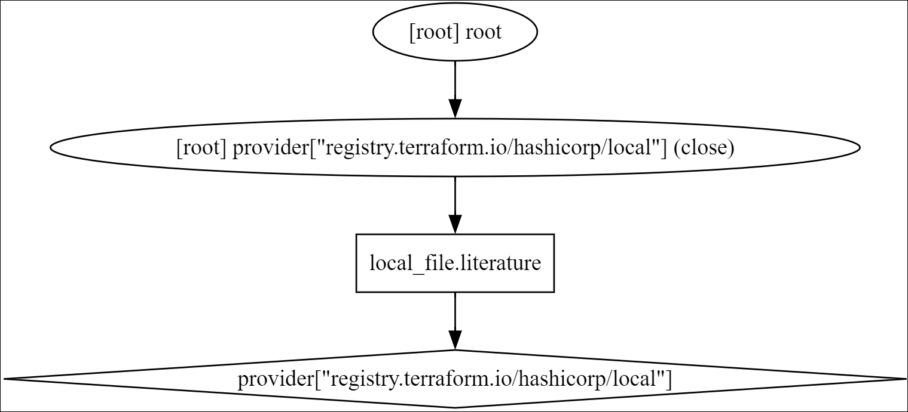

##### Inspecting the plan using JSON

Use the `-out` flag to read the output of `terraform plan` in JSON format. This is a two-step process:

```powershell
terraform plan -out plan.out
terraform show -json .\plan.out > plan.json
```
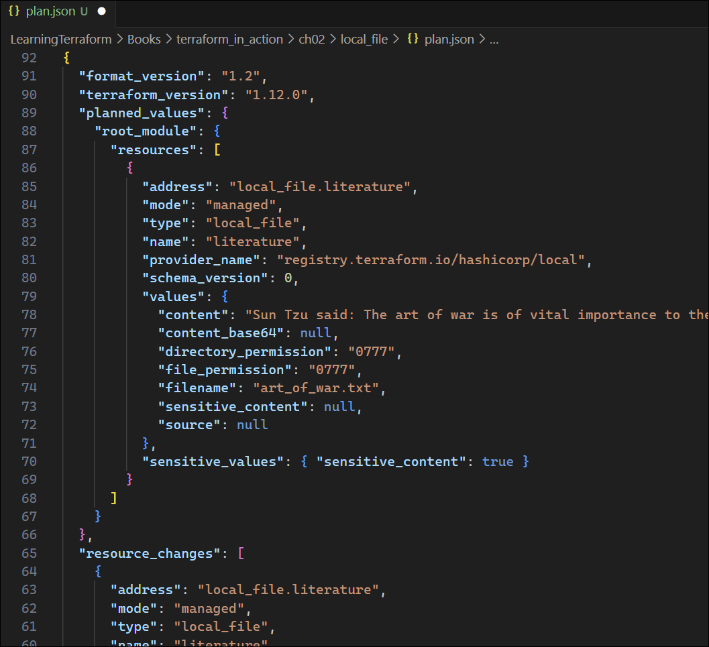

#### 2.5 Creating the local file resource

Run `terraform apply` to create the local file resource.

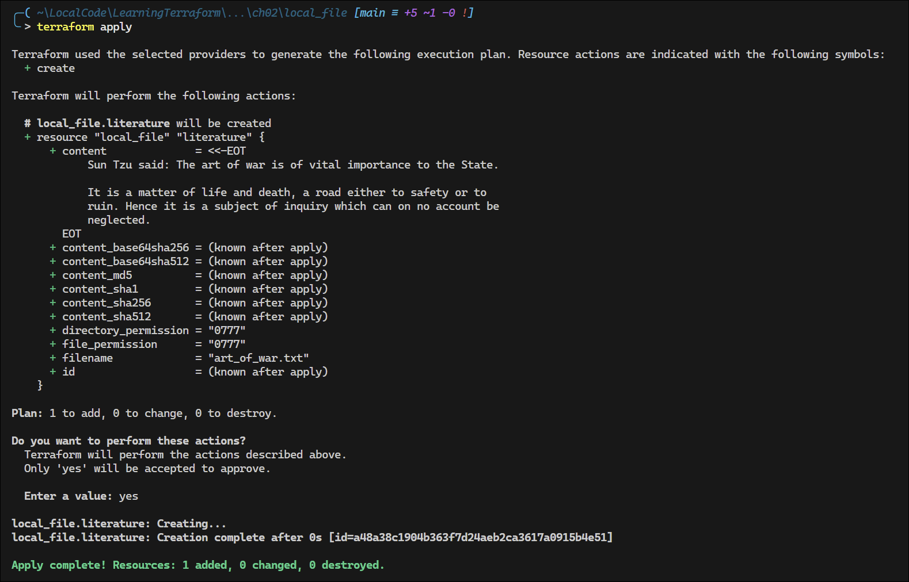

When using automation, you can chain the `plan` and `apply` commands together:

```powershell
terraform plan -out plan.out && terraform apply "plan.out" 
```

**Note:** It's always a good idea to review the contents of the plan first before applying it.

As a result of applying the plan, the file `art_of_war.txt` is created in the current working directory.

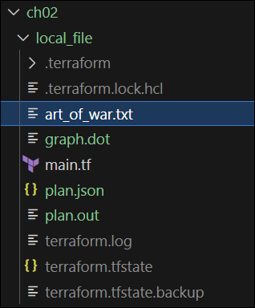

Terraform also creates a state file called `terraform.tfstate` in the current working directory. This file contains the current state of the infrastructure managed by Terraform. The state file is used to perform diffs during the plan and detect configuration drift.

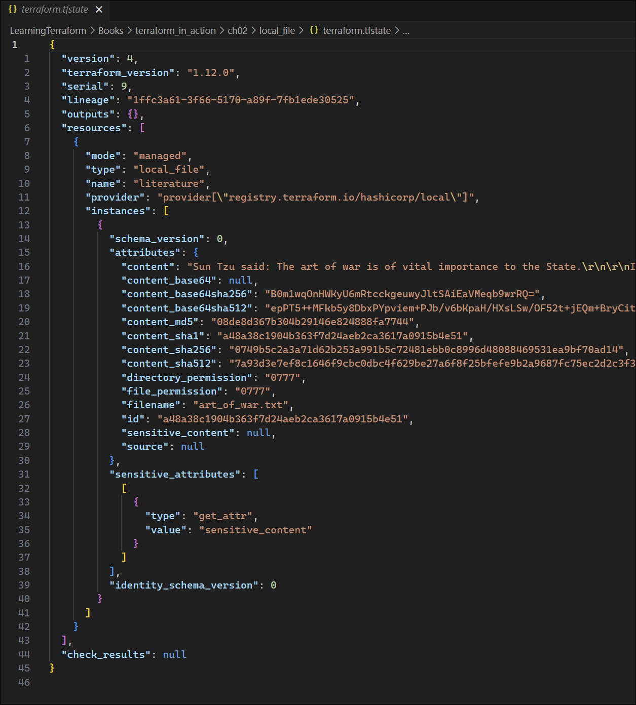

**Note:** Don't mess with this file!

#### 2.6 Performing No-Op

Use `terraform plan` to ensure resources are in a desired state. The resulting action is a no-operation (no-op) because the resource already exists and matches the desired state.

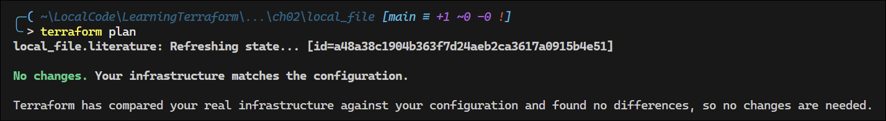

#### 2.7 Updating the local file resource

Updating the `main.tf` file to include more stanzas from the Art of War:

```hcl
terraform {
    required_version = ">= 0.15"
    required_providers {
        local = {
            source = "hashicorp/local"
            version = "~> 2.0"
        }
    }
}

resource "local_file" "literature" {
    filename = "art_of_war.txt"
    content  = <<-EOT
        Sun Tzu said: The art of war is of vital importance to the State.

        It is a matter of life and death, a road either to safety or to
        ruin. Hence it is a subject of inquiry which can on no account be
        neglected.

        The art of war, then, is governed by five constant factors, to be
        taken into account in one's deliberations, when seeking to
        determine the conditions obtaining in the field.

        These are: The Moral Law; Heaven; Earth; The Commander; Method and
        discipline.
    EOT
}
```

Running `terraform plan` will show that the resource is going to be updated and highlights changes:

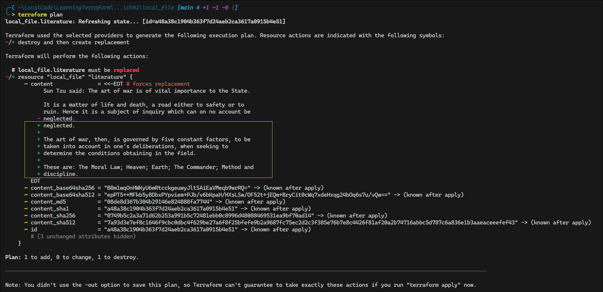

In this case, Terraform noticed we altered the `content` attribute and is therefore proposing to destroy the old resource and create a new resource in its stead. This is done rather than updating the attribute in place because `content` is marked as a *force new attribute*, which means if you change it, Terraform will destroy the old resource and create a new one. This is known as *immutable infrastructure*.

To apply the changes, run `terraform apply`, but this time with the `-auto-approve` flag to skip the confirmation prompt:

```cmd
terraform apply -auto-approve
```
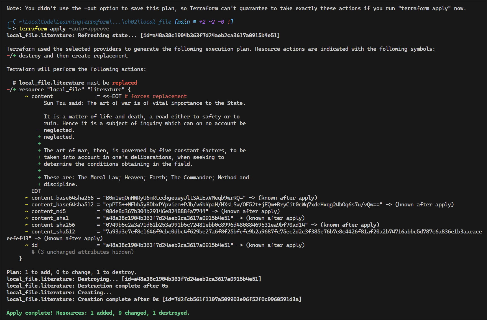

Verify changes to the file:

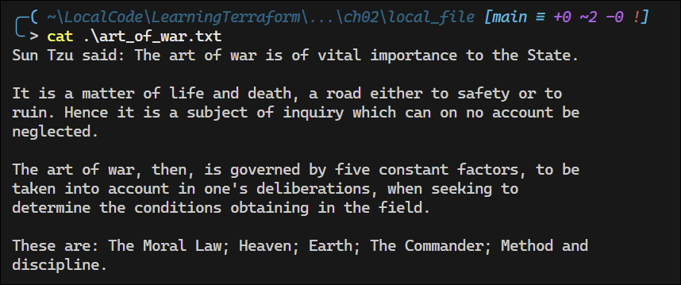

##### 2.7.1 Detecting configuration drift

To simulate configuration drift, we can manually edit the `art_of_war.txt` file and change its content:

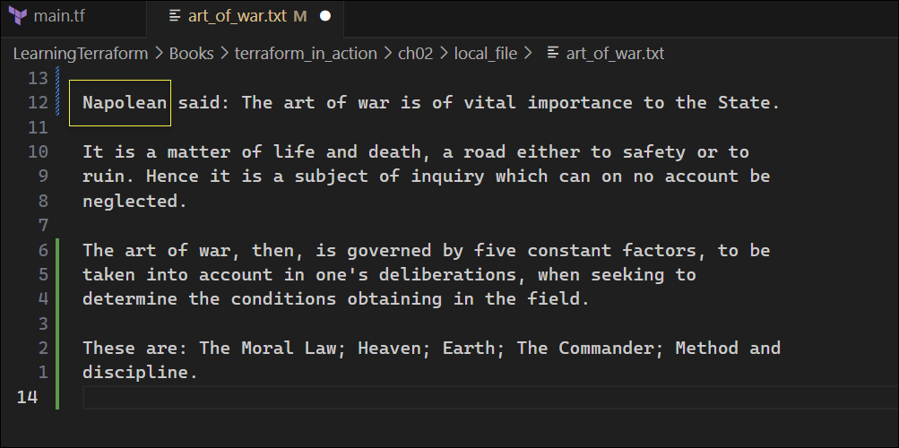

Now, if we run `terraform plan`, Terraform indicates it has forgotten the resource and will indicate its intent to recreate it:

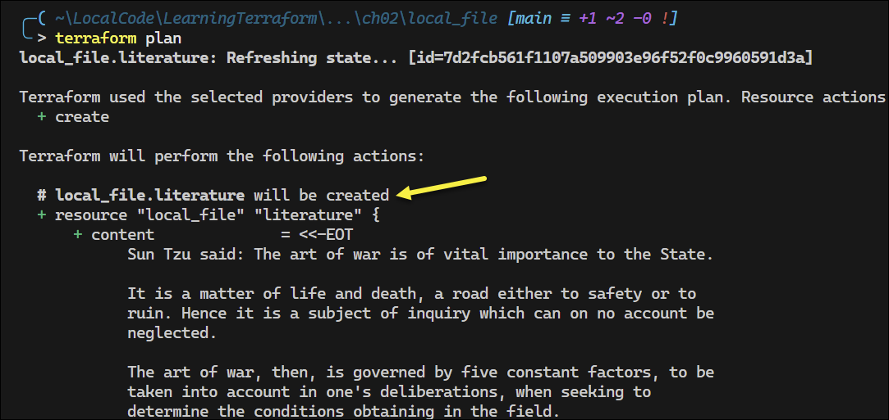v

##### Terraform refresh

How do you fix configuration drift? 

You can use `terraform refresh` to reconcile the state it knows about with what is currently deployed.

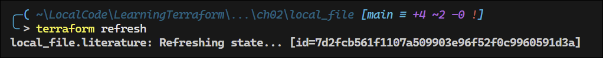

`terraform refresh` is like `terraform plan`, except that it alters the state file.

Now when running `terraform show`, nothing is returned because the `local` provider things the old file no longer exists:

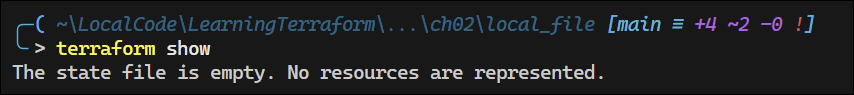

The author indicates he rarely finds `terraform refresh` useful, but some peeople really like it.

Now you can run `terraform apply` to recreate the file.

At this point if configuration drift had occurred in a cloud service, e.g. an admin made a point-and-click change to a resource, then Terraform would have reverted the change.

#### 2.8 Deleting the local file resource

Run `terraform destroy` to remove the local file.

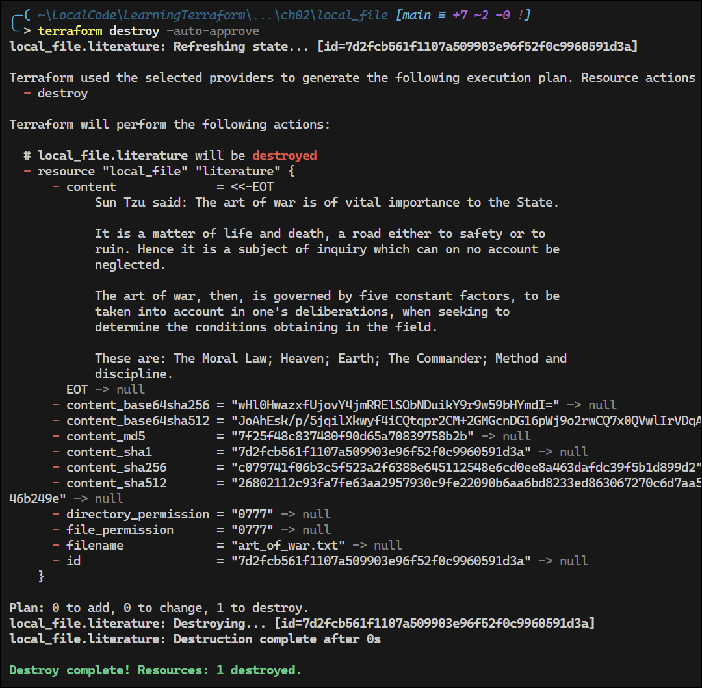

During the destroy operation, Terraform invokes `Delete()` on each resource in the state file.

Note that Terraform maintains a backup of the previous state file if needed:


### Chapter 3: Functional Programming

Functional programming allows you to do many things with a single line of code. The core principles of functional programming include:
- *Pure functions*&mdash;Functions return the same value for the same arguments, never having any side effects.
- *First-class and higher-order functions*&mdash;Functions are treated like any other variables and can be saved, passed around, and used to create higher-order functions.
- *Immutability*&mdash;Data is never directly modified. Instead, new data structures are created each time data would change.

Example of procedural code:

```js
const numList = [1, 2, 3, 4, 5, 6, 7, 8, 9, 10]
let result = 0;
for (let i = 0; i < numList.length; i++) {
  if (numList[i] % 2 === 0) {
    result += (numList[i] * 10)
  }
}
```

The same problem solved with functional programming:

```js
const numList = [1, 2, 3, 4, 5, 6, 7, 8, 9, 10]
const result = numList
    .filter(n => n % 2 === 0)
    .map(a => a * 10)
    .reduce((a, b) => a + b)
```

and in Terraform:

```hcl
locals {
  numList = [0, 1, 2, 3, 4, 5, 6, 7, 8, 9, 10]
  result  = sum([for x in local.numList : 10 * x if x % 2 == 0])
}
```

#### 3.1 Fun with Mad Libs

Mad Libs is a word game where players fill in the blanks with words to create a funny story. We'll use Terraform to generate a Mad Libs story.

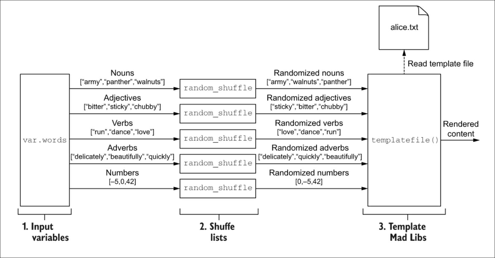

##### 3.1.1 Input Variables

The first objective is to create a word pool. To do this, we will use input variables. Input variables are user-supplied values that parameterize Terraform modules without altering the source code.

Example of a variable block:

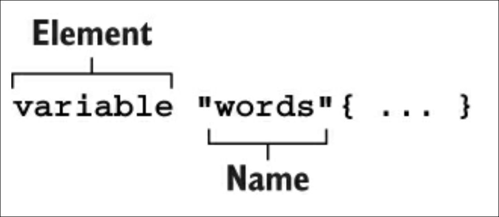

Variables accept four input arguments:
- `default`&mdash;A preselected option to use when no alternative is available. Leaving this argument blank means a variable is mandatory and must be explicity set.
- `description`&mdash;A string value providing context for the variable.
- `type`&mdash;A type constraint that limits the values a variable can accept. Types can be primitive (string, integer, bool) or complex (list, set, map, object, tuple).
- `validation`&mdash;A nested block that can enforce custom validation rules.

Variable values can be accessed using the `var` keyword, e.g. `var.name`.

In our scenario, we can define a variable for each particle of speech, e.g. nouns, adjectives, verbs:

```hcl
variable "nouns" {
  description = "A list of nouns"
  type        = list(string)
}
 
variable "adjectives" {
  description = "A list of adjectives"
  type        = list(string)
}

variable "verbs" {
  description = "A list of verbs"
  type        = list(string)
}
 
variable "adverbs" {
  description = "A list of adverbs"
  type        = list(string)
}
 
variable "numbers" {
  description = "A list of numbers"
  type        = list(number)
}
```

In Ter

```hcl
terraform {
    required_version = ">= 0.15"
}

variable "words" {
    description = "A word pool to use for Mad Libs"
    type = object({
        nouns      = list(string),
        adjectives = list(string),
        verbs      = list(string),
        adverbs    = list(string),
        numbers    = list(number)
    })
}
```
[File - `madlibs.tf`](ch03/madlibs.tf)

##### 3.1.2 Assigning values with a variable definition file

Assigning values with the `default` argument is a good idea because it doesn't facilitate code reuse. A better way is to use a variable defintion file, which is any file ending in either the `.tfvars` or `.tfvars.json` extension.

```hcl
words = {
  nouns      = ["army", "panther", "walnuts", "sandwich", "Zeus", "banana", "cat", "jellyfish", "jigsaw", "violin", "milk", "sun"]
  adjectives = ["bitter", "sticky", "thundering", "abundant", "chubby", "grumpy"]
  verbs      = ["run", "dance", "love", "respect", "kicked", "baked"]
  adverbs    = ["delicately", "beautifully", "quickly", "truthfully", "wearily"]
  numbers    = [42, 27, 101, 73, -5, 0]
}
```
[File - `madlibs.tfvars`](./ch03/madlibs.tfvars)

##### 3.1.3 Validating variables

You can use a custom validation block to validate input variables.

```hcl
variable "words" {
    description = "A word pool to use for Mad Libs"
    type = object({
        nouns      = list(string),
        adjectives = list(string),
        verbs      = list(string),
        adverbs    = list(string),
        numbers    = list(number)
    })
    validation {
        condition     = length(var.words["nouns"]) > = 20
        error_message = "At least 20 nouns must be supplied."
    }
}
```
[File - `madlibs.tf`](ch03/madlibs.tf)

##### 3.1.4 Shuffling lists

Terraform strives to be a functional programming language, which means all functions (with the exception of two) are pure functions. *Pure functions* return the same result for a given set of inputs and do not have side effects. `shuffle()` cannot be allowed because generated execution plans would not be repeatable.

> Note: `uuid()` and `timestamp()` are the two exceptions to the rule of pure functions.

The `Random` provider introduces a `random_shuffle` resource that can be used to shuffle lists. Given that we have five lists, we'll use five random suffles.

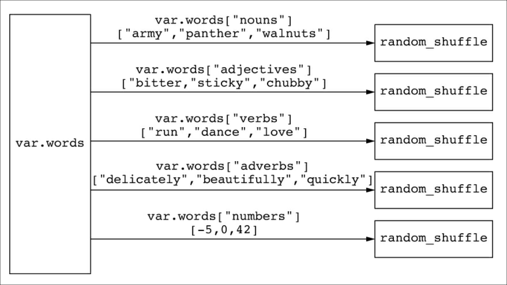

The Random provider allows for constrained randomness within Terraform configurations and is great for generating random strings and uuids. It's also helpful for preventing namespace collisions and for generating dynamic secrets like usernames and passwords.

```hcl
terraform {
    required_version = ">= 0.15"
    required_providers {                                            // Introducing the Random provider 
        random = {
            source = "hashicorp/random"
            version = "~> 3.0"
        }
    }
}

variable "words" {
    description = "A word pool to use for Mad Libs"
    type = object({
        nouns      = list(string),
        adjectives = list(string),
        verbs      = list(string),
        adverbs    = list(string),
        numbers    = list(number)
    })
    validation {
        condition     = length(var.words["nouns"]) > = 20
        error_message = "At least 20 nouns must be supplied."
    }
}

resource "random_shuffle" "random_nouns" {                          // Using the Random provider to shuffle lists
    input = var.words["nouns"]
}

resource "random_shuffle" "random_adjectives" {
    input = var.words["adjectives"]
}

resource "random_shuffle" "random_verbs" {
    input = var.words["verbs"]
}

resource "random_shuffle" "random_adverbs" {
    input = var.words["adverbs"]
}

resource "random_shuffle" "random_numbers" {
    input = var.words["numbers"]
}
```
[File - `madlibs.tf`](ch03/madlibs.tf)


##### 3.1.5 Functions
