# My notes on "Terraform in Action" by Scott Winkler


<details>
<summary>Book Resources</summary>

- [Book Code](https://github.com/terraform-in-action/manning-code)

</details>

<!-- omit from toc -->
## Helpful Commands

```cmd
terraform init      # Initialize a working directory containing Terraform configuration files
terraform apply     # Create or update infrastructure as defined in the configuration files
terraform show      # Show the current state of the infrastructure managed by Terraform
terraform fmt       # Format Terraform configuration files to a canonical format and style
```

<!-- omit from toc -->
## Terraform Resources
- [Install Terraform](https://developer.hashicorp.com/terraform/tutorials/aws-get-started/install-cli)

<!-- omit from toc -->
## Contents

- [Part 1: Terraform Bootcamp](#part-1-terraform-bootcamp)
  - [Chapter 1: Getting Started with Terraform](#chapter-1-getting-started-with-terraform)
    - [1.2 Hello Terraform Example](#12-hello-terraform-example)
      - [1.2.1 Writing the Configuration](#121-writing-the-configuration)
      - [1.2.2 Configuring the AWS Provider](#122-configuring-the-aws-provider)
      - [1.2.3 Initializing Terraform](#123-initializing-terraform)
      - [1.2.4 Deploying the EC2 Instance](#124-deploying-the-ec2-instance)
      - [1.2.5 Destroying the EC2 Instance](#125-destroying-the-ec2-instance)
    - [1.3 Brave new "Hello Terraform"](#13-brave-new-hello-terraform)
  - [Chapter 2: Life Cycle of a Terraform Resource](#chapter-2-life-cycle-of-a-terraform-resource)
    - [2.1 Process Overview](#21-process-overview)
    - [2.1.1 Life cycle function hooks](#211-life-cycle-function-hooks)
    - [2.2 Declaring a local file resource](#22-declaring-a-local-file-resource)
    - [2.3 Initializing the workspace](#23-initializing-the-workspace)
    - [2.4 Generating an execution plan](#24-generating-an-execution-plan)
      - [Enabling Trace Logging](#enabling-trace-logging)
      - [Troubleshooting slow-running plans](#troubleshooting-slow-running-plans)
      - [Stages of `terraform plan`](#stages-of-terraform-plan)
      - [Generating a dependency graph](#generating-a-dependency-graph)
      - [Inspecting the plan using JSON](#inspecting-the-plan-using-json)
    - [2.5 Creating the local file resource](#25-creating-the-local-file-resource)
    - [2.6 Performing No-Op](#26-performing-no-op)
    - [2.7 Updating the local file resource](#27-updating-the-local-file-resource)
      - [2.7.1 Detecting configuration drift](#271-detecting-configuration-drift)
      - [Terraform refresh](#terraform-refresh)
    - [2.8 Deleting the local file resource](#28-deleting-the-local-file-resource)
  - [Chapter 3: Functional Programming](#chapter-3-functional-programming)
    - [3.1 Fun with Mad Libs](#31-fun-with-mad-libs)
      - [3.1.1 Input Variables](#311-input-variables)
      - [3.1.2 Assigning values with a variable definition file](#312-assigning-values-with-a-variable-definition-file)
      - [3.1.3 Validating variables](#313-validating-variables)
      - [3.1.4 Shuffling lists](#314-shuffling-lists)
      - [3.1.5 Functions](#315-functions)
      - [3.1.6 Output values](#316-output-values)
      - [3.1.7 Templates](#317-templates)
      - [3.1.8 Printing output](#318-printing-output)
    - [3.2 Generating many Mad Libs stories](#32-generating-many-mad-libs-stories)
      - [3.2.1 `for` expressions](#321-for-expressions)
      - [3.2.2 Local values](#322-local-values)
      - [3.2.4 `count` parameter](#324-count-parameter)
      - [3.2.5 Conditional expressions](#325-conditional-expressions)
      - [3.2.6 More templates](#326-more-templates)
      - [3.2.7 Local file](#327-local-file)
      - [3.2.8 Zipping files](#328-zipping-files)
      - [3.2.9 Applying changes](#329-applying-changes)
      - [Expressions Reference](#expressions-reference)
  - [Chapter 4: Deploying a multi-tiered web application in AWS](#chapter-4-deploying-a-multi-tiered-web-application-in-aws)
    - [4.1 Architecture](#41-architecture)
    - [4.2 Terraform modules](#42-terraform-modules)
      - [4.2.1 Module syntax](#421-module-syntax)
      - [4.2.2 What is the root module?](#422-what-is-the-root-module)
      - [4.2.3 Standard module structure](#423-standard-module-structure)
    - [4.3 Root module](#43-root-module)
      - [4.3.1 Code](#431-code)
    - [4.4 Networking module](#44-networking-module)
    - [4.5 Database module](#45-database-module)
      - [4.5.1 Passing data from the networking module](#451-passing-data-from-the-networking-module)
      - [4.5.2 Generating a random password](#452-generating-a-random-password)
    - [4.6 Autoscaling module](#46-autoscaling-module)
      - [4.6.1 Trickling down data](#461-trickling-down-data)
      - [4.6.2 Templating a `cloudinit_config`](#462-templating-a-cloudinit_config)
    - [4.7 Deploying the web application](#47-deploying-the-web-application)
- [Part 2: Terraform in the wild](#part-2-terraform-in-the-wild)
  - [Chapter 5: Serverless made easy](#chapter-5-serverless-made-easy)
    - [5.1 The "two-penny website"](#51-the-two-penny-website)
    - [5.2 Architecture and planning](#52-architecture-and-planning)
      - [5.2.1 Sorting by group and then by size](#521-sorting-by-group-and-then-by-size)
    - [5.3 Writing the code](#53-writing-the-code)
      - [5.3.1 Resource group](#531-resource-group)
      - [5.3.2 Storage container](#532-storage-container)
      - [5.3.3 Storage blob](#533-storage-blob)
      - [5.3.4 Function app](#534-function-app)
      - [5.3.5 Final touches](#535-final-touches)
    - [5.4 Deploying to Azure](#54-deploying-to-azure)


## Part 1: Terraform Bootcamp

### Chapter 1: Getting Started with Terraform

#### 1.2 Hello Terraform Example

**Scenario**: Use Terraform to deploy a virtual machine (EC2 instance) on AWS.


The sequence of steps to deploy the EC2 instance using Terraform:


##### 1.2.1 Writing the Configuration

The HashiCorp Configuration Language (HCL)  is used to declare an aws_instance resource in a Terraform configuration file. The configuration file is a text file with a `.tf` extension. The file contains the following code:
```hcl
resource "aws_instance" "helloworld" {
  ami           = "ami-09dd2e08d601bff67"
  instance_type = "t2.micro"
  tags = {
    Name = "HelloWorld"
  }
}
```
The first line declares a resource and exactly two labels, the first is the type of resource (aws_instance) and the second is a name for the resource (helloworld). Together the type and name form a unique identifier for the resource.


The remaining lines of the resource block are called arguments.


##### 1.2.2 Configuring the AWS Provider

Providers can be either `aws`, `azurerm`, or `google`. 

```hcl
provider "aws" {
    region = "us-west-2"
}

resource "aws_instance" "helloworld" {
  ami           = "ami-09dd2e08d601bff67"
  instance_type = "t2.micro"
  tags = {
    Name = "HelloWorld"
  }
}
```
Things to note:
- Providers only have inputs, no outputs.


##### 1.2.3 Initializing Terraform

Run `terraform init` to initialize Terraform and download the AWS provider plugin:  


##### 1.2.4 Deploying the EC2 Instance

Run `terraform apply` to create the EC2 instance. Terraform will prompt for confirmation before proceeding with the deployment. After confirming, Terraform will create the EC2 instance and display the output.


After configuring AWS credentials...


Confirm resource creation: 


Information about the created resource is stored in the Terraform state file with the `.tfstate` extension:


> IMPORTANT: Do not manuaually edit or delete the `.tfstate` file. Terraform uses this file to keep track of the resources it manages. If you edit or delete it, Terraform may lose track of the resources and cause issues in future operations.

Use `terraform show` to display the current state of the infrastructure managed by Terraform. This command will show the details of the EC2 instance created in the previous step.


##### 1.2.5 Destroying the EC2 Instance

Run `terraform destroy` to remove the EC2 instance created in the previous step. 


#### 1.3 Brave new "Hello Terraform"

Terraform can also provision resources dynamically based on the results of external queries and data lookups.

*Data sources* are elements that allow you to fetch data at runtime and perform computations.

In the following example, we pass the output value into `aws_instance` so that we don't have to statically set the AMI in the EC2 instance resource configuration.


```hcl
provider "aws" {
    profile = "tf-user"
    region = "us-west-2"
}

# Data sources are declared having exactly two labels
# The type, "aws_ami", and name, "ubuntu", must be unique within the module
data "aws_ami" "ubuntu" {
    most_recent = true
    filter {
        name = "name"
        values = ["ubuntu/images/hvm-ssd/ubuntu-focal-20.04-amd64-server-*"]
    }
    owners = ["099720109477"]       # Represents the owner of the AMI, in this case, Canonical
}

# Resources are declared having exactly two labels
resource "aws_instance" "helloworld" {
  ami           = data.aws_ami.ubuntu.id
  instance_type = "t2.micro"
  tags          = {
    Name = "HelloWorld"
  }
}
```

Use the following commands to create, show, and destroy the EC2 instance:

```powershell
terraform apply         # Create the EC2 instance
terraform show          # Show the current state of the infrastructure
terraform destroy       # Remove the EC2 instance
```


### Chapter 2: Life Cycle of a Terraform Resource

Fundamentally, Terraform is a state operation tool that performs CRUD operations on managed resources.

Terraform has *local-only resources* that exist only within the confines of Terraform or the machine running Terraform. These resources are not managed by any provider and are not created or destroyed in the cloud. They are used to manage local state and configuration.

Examples include reosurces for creating private keys, self-signed certificates,  and random ids.

#### 2.1 Process Overview

We will use the `local_file` resource from the `Local` provider to create, read, update, and delete a text file.


Here's a look at the workflow:


#### 2.1.1 Life cycle function hooks

All Terraform resources implement the resource schema interface. This schema mandates CRUD function hooks, one each for `Create()`, `Read()`, `Update()`, and `Delete()` operations. 

Because it's a resource, `local_file` also implements this interface.


#### 2.2 Declaring a local file resource

```hcl
terraform {
    required_version = ">= 0.15"
    required_providers {
        local = {
            source = "hashicorp/local"
            version = "~> 2.0"
        }
    }
}

resource "local_file" "literature" {
    filename = "art_of_war.txt"
    content  = <<-EOT
        Sun Tzu said: The art of war is of vital importance to the State.

        It is a matter of life and death, a road either to safety or to
        ruin. Hence it is a subject of inquiry which can on no account be
        neglected.
    EOT
}

```
**Note:**  
- The `terrraform` block configures Terraform. Its primary use is version-locking your code, but it can also configure where your state file is stored and where providers are downloaded.
- The second configuration block declares a `local_file` resource and stores text in a file called `art_of_war.txt`. 
- The `<<-EOT` syntax is called *heredoc* and allows you to write multi-line strings. The `EOT` at the end of the block indicates the end of the heredoc. The leading whitespace is ignored.

#### 2.3 Initializing the workspace

Terraform configuration must always be initialized at least once, but you may have to initialize again if you add new providers or modules.

```cmd
terraform init
```


Note that Terraform creates a hidden directory for installing plugins and modules:


**Tip:** version lock any providers you use to ensure deployments are repeatable.

```hcl
terraform {
    required_version = ">= 0.15"
    required_providers {
        local = {
            source = "hashicorp/local"
            version = "~> 2.0"
        }
    }
}
```

Lockfile: 


#### 2.4 Generating an execution plan

Always run `terraform plan` before deploying.

```cmd
terraform plan
```


##### Enabling Trace Logging

Plans can fail for many reasons. For verbose logs, you can turn on trace-level logging by setting the `TF_LOG` environment variable to a non-zero value, e.g. `TF_LOG=TRACE`. 

```powershell
$env:TF_LOG = 'TRACE'       # Other options: DEBUG, INFO, WARN, ERROR
$env:TF_LOG_PATH = ".\terraform.log"
```


##### Troubleshooting slow-running plans

Turn off trace logging and consider increasing parallelism.

```cmd
terraform plan -parallelism=50
```
By default, Terraform uses a parallelism of 10. Note that too high of a parallelism can cause failures like API throttling.

`terraform apply` will need similar tuning.

##### Stages of `terraform plan`

Three main stages:
1. Read the configuration and state.
2. Determine the actions to take.
3. Output the plan.


##### Generating a dependency graph

Use `terraform graph` to generate a dependency graph for visualizing the relationships between resources. 

```
terraform graph -type=plan > graph.dot
terraform graph -type=apply > graph.dot
```
**Example:** from `terraform graph -type=plan`:  


##### Inspecting the plan using JSON

Use the `-out` flag to read the output of `terraform plan` in JSON format. This is a two-step process:

```powershell
terraform plan -out plan.out
terraform show -json .\plan.out > plan.json
```


#### 2.5 Creating the local file resource

Run `terraform apply` to create the local file resource.


When using automation, you can chain the `plan` and `apply` commands together:

```powershell
terraform plan -out plan.out && terraform apply "plan.out" 
```

**Note:** It's always a good idea to review the contents of the plan first before applying it.

As a result of applying the plan, the file `art_of_war.txt` is created in the current working directory.


Terraform also creates a state file called `terraform.tfstate` in the current working directory. This file contains the current state of the infrastructure managed by Terraform. The state file is used to perform diffs during the plan and detect configuration drift.


**Note:** Don't mess with this file!

#### 2.6 Performing No-Op

Use `terraform plan` to ensure resources are in a desired state. The resulting action is a no-operation (no-op) because the resource already exists and matches the desired state.


#### 2.7 Updating the local file resource

Updating the `main.tf` file to include more stanzas from the Art of War:

```hcl
terraform {
    required_version = ">= 0.15"
    required_providers {
        local = {
            source = "hashicorp/local"
            version = "~> 2.0"
        }
    }
}

resource "local_file" "literature" {
    filename = "art_of_war.txt"
    content  = <<-EOT
        Sun Tzu said: The art of war is of vital importance to the State.

        It is a matter of life and death, a road either to safety or to
        ruin. Hence it is a subject of inquiry which can on no account be
        neglected.

        The art of war, then, is governed by five constant factors, to be
        taken into account in one's deliberations, when seeking to
        determine the conditions obtaining in the field.

        These are: The Moral Law; Heaven; Earth; The Commander; Method and
        discipline.
    EOT
}
```

Running `terraform plan` will show that the resource is going to be updated and highlights changes:


In this case, Terraform noticed we altered the `content` attribute and is therefore proposing to destroy the old resource and create a new resource in its stead. This is done rather than updating the attribute in place because `content` is marked as a *force new attribute*, which means if you change it, Terraform will destroy the old resource and create a new one. This is known as *immutable infrastructure*.

To apply the changes, run `terraform apply`, but this time with the `-auto-approve` flag to skip the confirmation prompt:

```cmd
terraform apply -auto-approve
```


Verify changes to the file:


##### 2.7.1 Detecting configuration drift

To simulate configuration drift, we can manually edit the `art_of_war.txt` file and change its content:


Now, if we run `terraform plan`, Terraform indicates it has forgotten the resource and will indicate its intent to recreate it:

v

##### Terraform refresh

How do you fix configuration drift? 

You can use `terraform refresh` to reconcile the state it knows about with what is currently deployed.


`terraform refresh` is like `terraform plan`, except that it alters the state file.

Now when running `terraform show`, nothing is returned because the `local` provider things the old file no longer exists:


The author indicates he rarely finds `terraform refresh` useful, but some peeople really like it.

Now you can run `terraform apply` to recreate the file.

At this point if configuration drift had occurred in a cloud service, e.g. an admin made a point-and-click change to a resource, then Terraform would have reverted the change.

#### 2.8 Deleting the local file resource

Run `terraform destroy` to remove the local file.


During the destroy operation, Terraform invokes `Delete()` on each resource in the state file.

Note that Terraform maintains a backup of the previous state file if needed:


### Chapter 3: Functional Programming

Functional programming allows you to do many things with a single line of code. The core principles of functional programming include:
- *Pure functions*&mdash;Functions return the same value for the same arguments, never having any side effects.
- *First-class and higher-order functions*&mdash;Functions are treated like any other variables and can be saved, passed around, and used to create higher-order functions.
- *Immutability*&mdash;Data is never directly modified. Instead, new data structures are created each time data would change.

Example of procedural code:

```js
const numList = [1, 2, 3, 4, 5, 6, 7, 8, 9, 10]
let result = 0;
for (let i = 0; i < numList.length; i++) {
  if (numList[i] % 2 === 0) {
    result += (numList[i] * 10)
  }
}
```

The same problem solved with functional programming:

```js
const numList = [1, 2, 3, 4, 5, 6, 7, 8, 9, 10]
const result = numList
    .filter(n => n % 2 === 0)
    .map(a => a * 10)
    .reduce((a, b) => a + b)
```

and in Terraform:

```hcl
locals {
  numList = [0, 1, 2, 3, 4, 5, 6, 7, 8, 9, 10]
  result  = sum([for x in local.numList : 10 * x if x % 2 == 0])
}
```

#### 3.1 Fun with Mad Libs

Mad Libs is a word game where players fill in the blanks with words to create a funny story. We'll use Terraform to generate a Mad Libs story.


##### 3.1.1 Input Variables

The first objective is to create a word pool. To do this, we will use input variables. Input variables are user-supplied values that parameterize Terraform modules without altering the source code.

Example of a variable block:


Variables accept four input arguments:
- `default`&mdash;A preselected option to use when no alternative is available. Leaving this argument blank means a variable is mandatory and must be explicity set.
- `description`&mdash;A string value providing context for the variable.
- `type`&mdash;A type constraint that limits the values a variable can accept. Types can be primitive (string, integer, bool) or complex (list, set, map, object, tuple).
- `validation`&mdash;A nested block that can enforce custom validation rules.

Variable values can be accessed using the `var` keyword, e.g. `var.name`.

In our scenario, we can define a variable for each particle of speech, e.g. nouns, adjectives, verbs:

```hcl
variable "nouns" {
  description = "A list of nouns"
  type        = list(string)
}
 
variable "adjectives" {
  description = "A list of adjectives"
  type        = list(string)
}

variable "verbs" {
  description = "A list of verbs"
  type        = list(string)
}
 
variable "adverbs" {
  description = "A list of adverbs"
  type        = list(string)
}
 
variable "numbers" {
  description = "A list of numbers"
  type        = list(number)
}
```

In Ter

```hcl
terraform {
    required_version = ">= 0.15"
}

variable "words" {
    description = "A word pool to use for Mad Libs"
    type = object({
        nouns      = list(string),
        adjectives = list(string),
        verbs      = list(string),
        adverbs    = list(string),
        numbers    = list(number)
    })
}
```
[File - `madlibs.tf`](ch03/madlibs.tf)

##### 3.1.2 Assigning values with a variable definition file

Assigning values with the `default` argument is not a good idea because it doesn't facilitate code reuse. A better way is to use a variable defintion file, which is any file ending in either the `.tfvars` or `.tfvars.json` extension.

```hcl
words = {
  nouns      = ["army", "panther", "walnuts", "sandwich", "Zeus", "banana", "cat", "jellyfish", "jigsaw", "violin", "milk", "sun"]
  adjectives = ["bitter", "sticky", "thundering", "abundant", "chubby", "grumpy"]
  verbs      = ["run", "dance", "love", "respect", "kicked", "baked"]
  adverbs    = ["delicately", "beautifully", "quickly", "truthfully", "wearily"]
  numbers    = [42, 27, 101, 73, -5, 0]
}
```
[File - `terraform.tfvars`](./ch03/terraform.tfvars)

Terraform will automatically load the `terraform.tfvars` file. If you choose to use a different file name, you can specify it with the `-var-file` flag when running `terraform plan` or `terraform apply`.


##### 3.1.3 Validating variables

You can use a custom validation block to validate input variables.

```hcl
variable "words" {
    description = "A word pool to use for Mad Libs"
    type = object({
        nouns      = list(string),
        adjectives = list(string),
        verbs      = list(string),
        adverbs    = list(string),
        numbers    = list(number)
    })
    validation {
        condition     = length(var.words["nouns"]) > = 20
        error_message = "At least 20 nouns must be supplied."
    }
}
```
[File - `madlibs.tf`](ch03/madlibs.tf)

##### 3.1.4 Shuffling lists

Terraform strives to be a functional programming language, which means all functions (with the exception of two) are pure functions. *Pure functions* return the same result for a given set of inputs and do not have side effects. `shuffle()` cannot be allowed because generated execution plans would not be repeatable.

> Note: `uuid()` and `timestamp()` are the two exceptions to the rule of pure functions.

The `Random` provider introduces a `random_shuffle` resource that can be used to shuffle lists. Given that we have five lists, we'll use five random suffles.


The Random provider allows for constrained randomness within Terraform configurations and is great for generating random strings and uuids. It's also helpful for preventing namespace collisions and for generating dynamic secrets like usernames and passwords.

```hcl
terraform {
    required_version = ">= 0.15"
    required_providers {                                            // Introducing the Random provider 
        random = {
            source = "hashicorp/random"
            version = "~> 3.0"
        }
    }
}

variable "words" {
    description = "A word pool to use for Mad Libs"
    type = object({
        nouns      = list(string),
        adjectives = list(string),
        verbs      = list(string),
        adverbs    = list(string),
        numbers    = list(number)
    })
    validation {
        condition     = length(var.words["nouns"]) > = 20
        error_message = "At least 20 nouns must be supplied."
    }
}

resource "random_shuffle" "random_nouns" {                          // Using the Random provider to shuffle lists
    input = var.words["nouns"]
}

resource "random_shuffle" "random_adjectives" {
    input = var.words["adjectives"]
}

resource "random_shuffle" "random_verbs" {
    input = var.words["verbs"]
}

resource "random_shuffle" "random_adverbs" {
    input = var.words["adverbs"]
}

resource "random_shuffle" "random_numbers" {
    input = var.words["numbers"]
}
```
[File - `madlibs.tf`](ch03/madlibs.tf)


##### 3.1.5 Functions

Terraform does not have support for user-defined functions, nor is there a way to import functions from external libraries. However, it does have roughly 100 built-in functions that can be used.

We'll use the built-in `templatefile()` function to replace placeholder values in the template file with the shuffled words.

> Note: You extend Terraform by writing your own provider, not by writing your own functions.

Here is the syntax of the `templatefile()` function:


The `templatefile()` function takes two arguments:
1. `filename`&mdash;The path to the template file.
2. `vars`&mdash;A map of variables to replace in the template file.

We'll construct the map of template variables by aggregating together the lists of shuffled words:


Here's the `templatefile()` code:

```hcl
templatefile("${path.module}/templates/alice.txt",
{
    nouns      = random_shuffle.random_nouns.result
    adjectives = random_shuffle.random_adjectives.result
    verbs      = random_shuffle.random_verbs.result
    adverbs    = random_shuffle.random_adverbs.result
    numbers    = random_shuffle.random_numbers.result
})
```

##### 3.1.6 Output values

Output values are used for two things:
1. Pass values between modules.
2. Print values to the CLI.

You can return the result of the `templatefile()` function as an output value by printing to the CLI:


```hcl
output "mad_libs" {
  value = templatefile("${path.module}/templates/alice.txt",
    {
      nouns      = random_shuffle.random_nouns.result
      adjectives = random_shuffle.random_adjectives.result
      verbs      = random_shuffle.random_verbs.result
      adverbs    = random_shuffle.random_adverbs.result
      numbers    = random_shuffle.random_numbers.result
  })
}
```
[File - `madlibs.tf`](ch03/madlibs.tf)

##### 3.1.7 Templates

Next, we will create a template file that will be used to generate the Mad Libs story. By using interpolation, i.e. the `${...}` marker, the template file will contain placeholders for the words that will be replaced by the shuffled words. 

The template file, which resides in the `templates` directory, is called `alice.txt` and contains the following content:


String templates allow you to evaluate an expression and coerce the result into a string. An expression can be evaluated with template syntax, but you are restricted by variable scope. Only passed-in template variable are in scope; all other variables and resources&mdash;even within the same module&mdash;are not in scope.


##### 3.1.8 Printing output

We're now ready to generate our first Mad Libs paragraph. Initalize Terraform and then apply these changes:

```cmd
terraform init && terraform apply -auto-approve
```


#### 3.2 Generating many Mad Libs stories

You can generate multiple Mad Libs stories by using the `count` meta argument.

To support this, we'll introduce the following changes:
1. Create 100 Mad Libs paragraphs
2. Use three template files (alice.txt, observatory.txt, and photographer.txt)
3. Capitalize each word before shuffling.
4. Save the Mad Libs paragraphs as text files.
5. Zip all of them together.


##### 3.2.1 `for` expressions

The step for upppercasing strings in `var.words` was introduced to make it easier to see templated words.

The result of the uppercase function is saved into a local value, which is then fed into `random_shuffle`. To do this, you need to employ a `for` expression.

`for` expressions are anonymous functions that transform one complex type into another. The brackets around the `for` expression determine the output type. In this case, `[...]` indicates a list. 


Example showing the processing of the `nouns` list:


If `{...}` were used, the result would be a map.


Example showing the iteration over `var.words` and outputting a map:


`for` expressions are useful because (1) they can convert one type to another and (2) simple expressions can be combined to construct higher-order functions.

To make a `for` expression that uppercases each word in `var.words`, we combine two smaller `for` expressions into one *mega* `for` expression.

```hcl
{for k, v in var.words : k => [for s in v : upper(s)] if k != "numbers" }
```

This expression iterates over each key-value pair in `var.words`, and for each value (which is a list), it applies the `upper()` function to each string in the list. The result is a new map where each list of words is uppercased. The `if k != "numbers"` condition is used to exclude the `numbers` key from the output, as we don't want to uppercase numbers.

##### 3.2.2 Local values

Local values assign a name to an expression. They are defined using the `locals` block:


In `madlibs.tf`, we introduce the `uppercase_words` local value to transform each word:

```hcl
locals {
  uppercase_words = {for k, v in var.words : k => [for s in v : upper(s)]}
}
```

Further down, the `uppercase_words` local value is used to uppercase the words:

```hcl
resource "random_shuffle" "random_nouns" {
  input = local.uppercase_words["nouns"]
}

resource "random_shuffle" "random_adjectives" {
  input = local.uppercase_words["adjectives"]
}

resource "random_shuffle" "random_verbs" {
  input = local.uppercase_words["verbs"]
}

resource "random_shuffle" "random_adverbs" {
  input = local.uppercase_words["adverbs"]
}

resource "random_shuffle" "random_numbers" {
  input = local.uppercase_words["numbers"]
}
```

**Note:** omitted section 3.2.3 on implicit dependencies because the author did not explain it well.

##### 3.2.4 `count` parameter

To make 100 Mad Libs stories, we'll use the `count` meta argument to dynamically provision resources. Count is a *meta argument*, which means all resources intrinsincally support it by virtue of being a Terraform resource.

The address of a Terraform resource uses the format `resource_type.resource_name`. If `count` is set, the value becomes a list of terraform resources, and the address becomes `resource_type.resource_name[index]`, where `index` is the zero-based index of the resource in the list.

Creating a new variable to control the number of files to create:
```hcl
variable "num_files" {
  default = 100
  type    = number
}
```
Defining the `count` meta argument for the `random_shuffle` Terraform resources:

```hcl
resource "random_shuffle" "random_nouns" {
  count = var.num_files
  input = local.uppercase_words["nouns"]
}

resource "random_shuffle" "random_adjectives" {
  count = var.num_files
  input = local.uppercase_words["adjectives"]
}

resource "random_shuffle" "random_verbs" {
  count = var.num_files
  input = local.uppercase_words["verbs"]
}

resource "random_shuffle" "random_adverbs" {
  count = var.num_files
  input = local.uppercase_words["adverbs"]
}

resource "random_shuffle" "random_numbers" {
  count = var.num_files
  input = local.uppercase_words["numbers"]
}
```

##### 3.2.5 Conditional expressions

Conditional expressions are ternary operators. Before variables had validation blocks, conditional expressions were used to validate input variables. Nowadays, they serve a niche role.


The following conditional expression validates that at least one noun is supplied to the `nounds` word list:

```hcl
locals {
  v = length(var.words["nouns"]) >= 1 ? var.words["nouns"] : [][0]
}
```

If `var.words["nouns"]` doesn't contain at least one noun, then an error is thrown because `[][0]` always throws an error if it's evaluated (since it attempts to access the first element of an empty list).

Conditional expressions are most commonly used to toggle whether a resource will be created:

```hcl
count = var.shuffle_enabled ? 1 : 0
```

However, conditional expressions hurt readability, so use them sparingly.

##### 3.2.6 More templates

To generate multiple Mad Libs stories, we need to use multiple template files. We'll create three template files: `alice.txt`, `observatory.txt`, and `photographer.txt`. Each template file will have a different story.


##### 3.2.7 Local file

Instead of outputting to the CLI, we'll save the results to disk with a `local_file` resource.

For this, we'll use the built-in `fileset()` function:

```hcl
locals {
  templates = tolist(fileset(path.module, "templates/*.txt"))
}
```

**Note:** sets and lists look the same but are different, so an explicit cast must be made to convert a set to a list.

With the list of template files in place, we can feed the result into `local_file`. This resource generates `var.num_files` text files (i.e. 100 files):

```hcl
resource "local_file" "mad_libs" {
  count    = var.num_files
  filename = "madlibs/madlibs-${count.index}.txt"
  content = templatefile(element(local.templates, count.index),
    {
      nouns      = random_shuffle.random_nouns[count.index].result
      adjectives = random_shuffle.random_adjectives[count.index].result
      verbs      = random_shuffle.random_verbs[count.index].result
      adverbs    = random_shuffle.random_adverbs[count.index].result
      numbers    = random_shuffle.random_numbers[count.index].result
  })
}
```

Things to note:
- `element()` operates on a list as if it were circular, retrieving elements at a given index without throwing an out-of-bounds exception. This means `element()` evenly divides the 100 Mad Libs stories between the template files.
- `count.index` ensures that `templatefile()` receives template variables from corresponding `random_shuffle` resources.

##### 3.2.8 Zipping files

The `archive_file` data source can be used to create a zip file containing all the Mad Libs stories.

```hcl
data "archive_file" "mad_libs" {
  depends_on  = [local_file.mad_libs]           
  type        = "zip"
  source_dir  = "${path.module}/madlibs"
  output_path = "${path.cwd}/madlibs.zip"
}
```

Things to note:

- `depends_on` metag argument specifies explicit dependencies between resources. Explicit dependencies describe relationships between resources that are not visible to Terraform. 
- Normally, we would look to use an implicit dependency, but `archive_file` doesn't have any input arguments that make sense from the output of `local_file`, so we are forced to use an explicit dependency.

**Tip:** prefer implicit dependencies over explicit dependencies because they are clearer to someone reading your code.

##### 3.2.9 Applying changes

Run `terraform init` to download the new providers; then follow it with `terraform apply`:

```powershell
terraform init && terraform apply -auto-approve
```

The result is the creation of 100 Mad Libs stories, each saved as a text file in the `madlibs` directory. The stories are also zipped into a single file called `madlibs.zip`.


##### Expressions Reference

| Name                        | Description                                                                 | Example                                                                                      |
|-----------------------------|-----------------------------------------------------------------------------|----------------------------------------------------------------------------------------------|
| Conditional expression      | Uses the value of a boolean expression to select one of two values           | `condition ? true_value : false_value`                                                       |
| Function call               | Transforms and combines values                                               | `<FUNCTION NAME>(<ARG 1>, <ARG2>)`                                                           |
| `for` expression              | Transforms one complex type to another                                       | `[for s in var.list : upper(s)]`                                                             |
| Splat expression            | Shorthand for some common use cases that could otherwise be handled by for expressions | `var.list[*].id`<br>Following is the equivalent for expression:<br>`[for s in var.list : s.id]` |
| Dynamic block               | Constructs repeatable nested blocks within resources                         | ```dynamic "ingress" {``` <br> ```for_each = var.service_ports``` <br> ```  content {``` <br> ```    from_port = ingress.value``` <br>  ```    to_port   = ingress.value``` <br>  ```    protocol = "tcp"``` <br> ``` }``` <br> ```}``` |
| String template interpolation | Embeds expressions in a string literal                                      | `"Hello, ${var.name}!"`                                                                      |
| String template directives  | Uses conditional results and iterates over a collection within a string literal | ```%{ for ip in var.list.*.ip }```<br> ```server ${ip}``` <br> ```%{ endfor }```                |

### Chapter 4: Deploying a multi-tiered web application in AWS

This chapter covers:
- Deploying a multi-tiered web application in AWS using Terraform.
- Setting project variables in variables definition files.
- Organizing code with nested modules.
- Using modules from the Terraform Registry.
- Passing data between modules using input variables and output values.

A three-tiered application typically consists of the following layers:
1. Presentation layer (frontend)
2. Application layer, i.e. a REST API (backend)
3. Data layer (database)

In this chapter, we'll deploy a three-tiered web application for a social media site geared toward pet owners.

#### 4.1 Architecture

We're going to put some EC2 instances in an autoscaling group and then put that behind a load balancer. The load balancer will be public-facing, and the instances and databsase will be on private subnets with firewall rules dictated by security groups.


This deployment will be split into three components:
- Networking: VPC, subnets, and security groups
- Database: The SQL database infrastructure
- Autoscaling: Load balancer, EC2 autoscaling group, and launch template resources

In Terraform, the components in which resources are organized are called *modules*. 

#### 4.2 Terraform modules

Modules are self-contained packages of code that allow you to create reusable components by grouping related resources together.

##### 4.2.1 Module syntax

If resources and data sources are the individual building blocks of Terraform, then modules are prefabricated groupings of many such blocks.


Here is the syntax for module declarations. 


##### 4.2.2 What is the root module?

Every workspace has a *root module*; it's the directory where you run `terraform apply`. Under the root module, you may have one or more child modules to help you organize and reuse configurations.

Modules can be sourced locally, i.e. embedded within the root module, or remotely, i.e. they are downloaded from a remote location as part of `terraform init`.

Here is the overall module structure:


##### 4.2.3 Standard module structure

Hashicorp stronlgy recommends that every module follow certain code conventions known as the *standard module structure* (https://developer.hashicorp.com/terraform/language/modules/develop).

At a minimum, this means having three Terraform configuration files per module:
- `main.tf`: the primary entry point
- `outputs.tf`: declarations for all output values
- `variables.tf`: declarations for all input variables

**Note:** `versions.tf`, `providers.tf`, and `README.md` are considered required files in the root module. This will be covered in a later chapter.

Detailed module structure:


#### 4.3 Root module

The root module is where user-supplied variables are configured and where Terraform commands such as `terraform init` and `terraform apply` are run.

In this module, there are three input variables: `namespace`, `ssh_key-pair`, and `region`.

There are two output values: `db_password` and `lb_dns_name`.

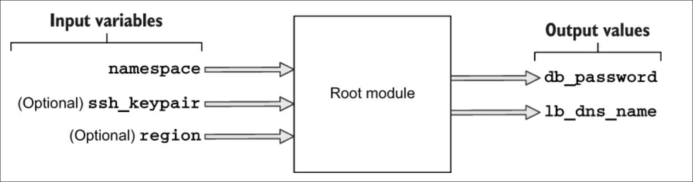

A user of the root module only needs to set the value of the `namespace` variable since the other two variables are optional. The output values are the provisioned load balancer's DNS name (`lb_dns_name`) and the database password (`db_password`).

The load balancer DNS name is how the user will navigate to the website from a browser.

The root module consists of six files:
- `variables.tf`: input variables
- `terraform.tfvars`: variables definition file
- `providers.tf`: provider declarations
- `main.tf`: primary entry point
- `outputs.tf`: output values
- `versions.tf`: provider version locking

##### 4.3.1 Code


[Root module - variables.tf](./ch04/three_tier/variables.tf)
```hcl
variable "namespace" {
  description = "The project namespace to use for unique resource naming"
  type        = string
}

variable "ssh_keypair" {
  description = "SSH keypair to use for EC2 instance"
  default     = null                                        # Null is useful for optional variables that don't have a meaningful default value          
  type        = string
}

variable "region" {
  description = "AWS region"
  default     = "us-west-2"
  type        = string
}
```

The variables definition file allows you to parameterize configuration code without having to hardcode default values. It only consists of variable names and assignments.

[Root module - terraform.tfvars](./ch04/three_tier/terraform.tfvars)
```hcl
namespace = "my-cool-project"
region    = "us-west-2"
```

The `region` variable is referenced in the provider declaration:

[File - `providers.tf`](./ch04/three_tier/providers.tf)
```hcl
provider "aws" {
  region = var.region
}
```

The `namespace` variable is a project identifier. Some modules use two variables instead, e.g. `project_name` and `environment`.

We pass `namespace` into each of the three child modules. The current module files will initially serve as stubs, but they will be fleshed out later.


[Root module - main.tf](./ch04/three_tier/main.tf)
```hcl
module "autoscaling" {
  source      = "./modules/autoscaling"             # Nested child modules are sourced from a local modules directory
  namespace   = var.namespace                       # Each module uses var.namespace for resource naming
}

module "database" {
  source    = "./modules/database"
  namespace = var.namespace
}

module "networking" {
  source    = "./modules/networking"
  namespace = var.namespace
}
```

[Root module - outputs.tf](./ch04/three_tier/outputs.tf)
```hcl
output "db_password" {
  value = "tbd"
}
output "lb_dns_name" {
  value = "tbd"
}
```

The last thing you want to do is lock  in the provider and Terraform versions. Normally, you would wait until after running `terraform init`, since that command downloads the provider plugins, but the author has already done this ahead of time.

[Root module - versions.tf](./ch04/three_tier/versions.tf)
```hcl
terraform {
  required_version = ">= 0.15"
  required_providers {
    aws = {
      source  = "hashicorp/aws"
      version = "~> 3.28"
    }
    random = {
      source  = "hashicorp/random"
      version = "~> 3.0"
    }
    cloudinit = {
      source  = "hashicorp/cloudinit"
      version = "~> 2.1"
    }
  }
}
```

#### 4.4 Networking module

The networking module includes the VPC, subnets, internet gateway, and security groups.

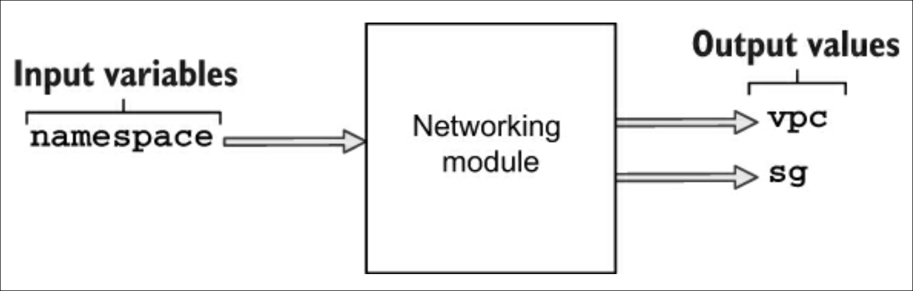

You can treat modules as functions with side effects (i.e. nonpure functions). The side effects are the resources provisioned as a result of `terraform apply`.

I created the `modules/networking` directory and added the following files:
- `main.tf`
- `variables.tf`
- `outputs.tf`

[Networking module - variables.tf:](./ch04/three_tier/modules/networking/variables.tf)
```hcl
variable "namespace" {
  type = string
}
``` 

Generally, resources declared at the top of the module have fewest dependencies, while resources delared at the bottom of the module have the most dependencies. 

Resources are also declared so that they feed into each other, one after another. This is sometimes called *resource chaining*.

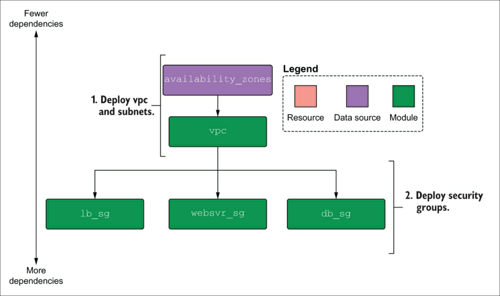

In the following file, note how some modules are made up of other modules. For example, instead of writing the code to deploy a VPC ourselves, we are using a VPC module maintained by the AWS team.

[Networking module - main.tf:](./ch04/modules/../three_tier/modules/networking/main.tf)
```hcl
data "aws_availability_zones" "available" {}

module "vpc" {                                                              # AWS VPC module published in the Terraform registry
  source                           = "terraform-aws-modules/vpc/aws"
  version                          = "2.64.0"
  name                             = "${var.namespace}-vpc"
  cidr                             = "10.0.0.0/16"
  azs                              = data.aws_availability_zones.available.names
  private_subnets                  = ["10.0.1.0/24", "10.0.2.0/24", "10.0.3.0/24"]
  public_subnets                   = ["10.0.101.0/24", "10.0.102.0/24", "10.0.103.0/24"]
  database_subnets                 = ["10.0.21.0/24", "10.0.22.0/24", "10.0.23.0/24"]

  create_database_subnet_group     = true
  enable_nat_gateway               = true
  single_nat_gateway               = true
}

module "lb_sg" {
  source = "terraform-in-action/sg/aws"
  vpc_id = module.vpc.vpc_id
  ingress_rules = [{
    port        = 80
    cidr_blocks = ["0.0.0.0/0"]
  }]
}

module "websvr_sg" {
  source = "terraform-in-action/sg/aws"                                     # Custom security group module published by the author
  vpc_id = module.vpc.vpc_id
  ingress_rules = [
    {
      port            = 8080
      security_groups = [module.lb_sg.security_group.id]
    },
    {
      port        = 22                                                      # Allows SSH for a potential bastion host
      cidr_blocks = ["10.0.0.0/16"]
    }
  ]
}

module "db_sg" {
  source = "terraform-in-action/sg/aws"
  vpc_id = module.vpc.vpc_id
  ingress_rules = [{
    port            = 3306
    security_groups = [module.websvr_sg.security_group.id]
  }]
}
```

In `outputs.tf`, note the `vpc` output passes a reference to the entire output of the VPC module. Also note how the `sg` output is made up of a new object containing the IDs of the security groups from different resources.

[Networking module - outputs.tf:](./ch04/three_tier/modules/networking/outputs.tf)
```hcl
output "vpc" {
  value = module.vpc
}

output "sg" {
  value = {
    lb     = module.lb_sg.security_group.id
    db     = module.db_sg.security_group.id
    websvr = module.websvr_sg.security_group.id
  }
}
```

#### 4.5 Database module

The database module provisions the database:

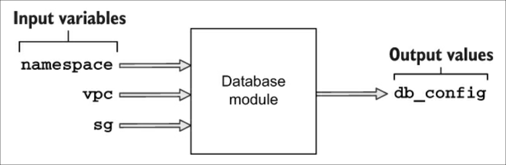

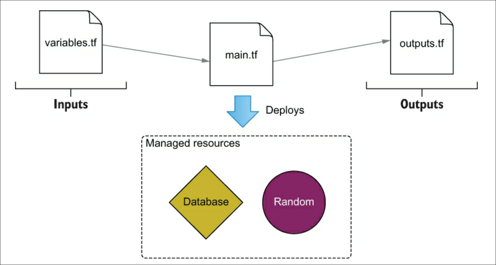

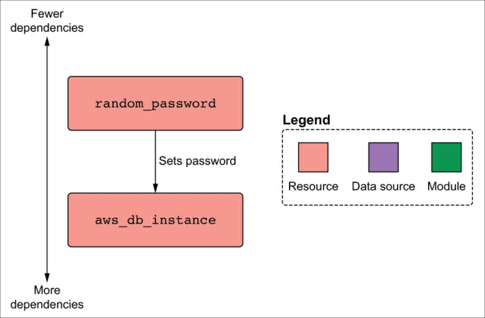

##### 4.5.1 Passing data from the networking module

THe database module requires references to VPC and database security group ID. Both of these are declared as outputs of the networking module. To get this data into the database module, you need to "bubble up" from the networking module into the root module, and then pass it down into the database module.

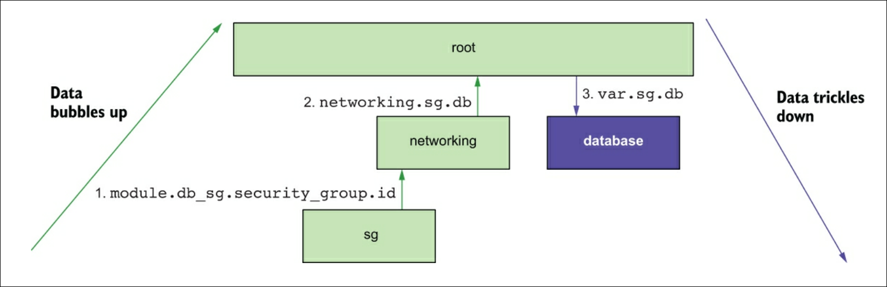

You can pass data between modules so that two modules can share each other's outputs. However, you should avoid interdependent modules because they can lead to circular dependencies.

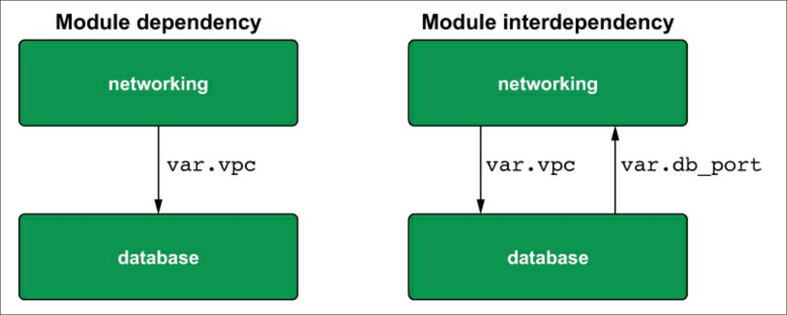

In the root module, we introduce references to the networking module outputs:

[Root module - main.tf](./ch04/three_tier/main.tf)
```hcl
module "autoscaling" {
  source      = "./modules/autoscaling"
  namespace   = var.namespace
}

module "database" {
  source    = "./modules/database"
  namespace = var.namespace

  vpc = module.networking.vpc                   # Reference to the VPC output from the networking module
  sg = module.networking.sg
}

module "networking" {
  source    = "./modules/networking"
  namespace = var.namespace
}
```

Next, I create the database module in the `modules/database` directory and add the following files:
- `main.tf`
- `variables.tf`
- `outputs.tf`

In the following code, the `vpc` and `sg` types are specified as `any` to allow for any type of data structure to be passed in. This is convenient for times when you don't care about strict type checking.

[Database module - variables.tf](./ch04/three_tier/modules/database/variables.tf)
```hcl
variable "namespace" {
  type = string
}

variable "vpc" {
  type = any                # A type constrain of "any" means that Terraform skips type checking
}

variable "sg" {
  type = any
}
```

##### 4.5.2 Generating a random password

We need to generate a random password for the database. 

[Database module - main.tf](./ch04/three_tier/modules/database/main.tf)

```hcl
resource "random_password" "password" {                     # Uses the random provider to create password
  length           = 16
  special          = true
  override_special = "!#$%&*()-_=+[]{}<>:?"
}

resource "aws_db_instance" "database" {
  allocated_storage      = 10
  engine                 = "mysql"
  engine_version         = "8.0"
  instance_class         = "db.t2.micro"
  identifier             = "${var.namespace}-db-instance"
  name                   = "pets"
  username               = "admin"
  password               = random_password.password.result
  db_subnet_group_name   = var.vpc.database_subnet_group        # These values come from the networking module
  vpc_security_group_ids = [var.sg.db]
  skip_final_snapshot    = true
}
```

Next, construct the output value consisting of the database configuration required for the application to connect to the database:

[Database module - outputs.tf](./ch04/three_tier/modules/database/outputs.tf)
```hcl
output "db_config" {
  value = {
    user     = aws_db_instance.database.username            # All of this data comes from the output of the aws_db_instance resource
    password = aws_db_instance.database.password
    database = aws_db_instance.database.name
    hostname = aws_db_instance.database.address
    port     = aws_db_instance.database.port
  }
}
```

Moving back to the root module, we can make the database password availabe to the CLI user by adding an output value in `outputs.tf`:

[Root module - outputs.tf]()
```hcl
output "db_password" {
  value = module.database.db_config.password                # Output value from the database module
}

output "lb_dns_name" {
  value = "tbd"
}
```

#### 4.6 Autoscaling module

This module provisions the autoscaling group, load balancer, Identity and Access Management (IAM) instance role, and everything else the web server needs to run.

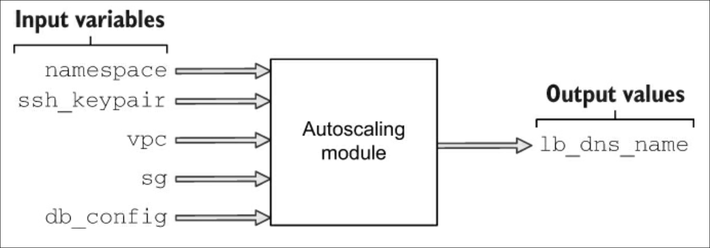

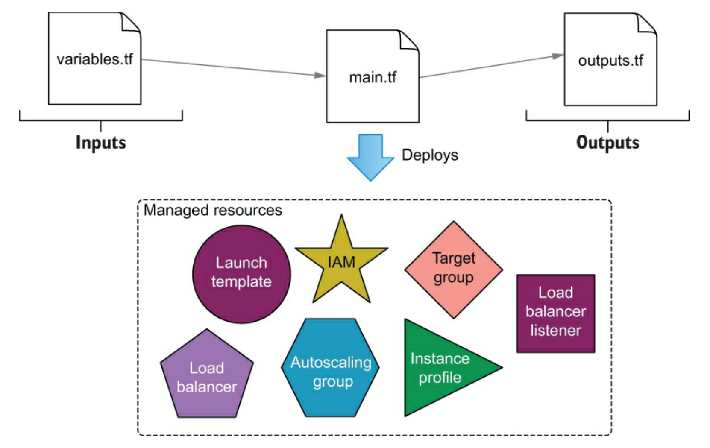


##### 4.6.1 Trickling down data

The three input variables of the autoscaling module are `vpc`, `sg`, and `db_config`. `vpc` and `sg` come from the networking module, while `db_config` comes from the database module.

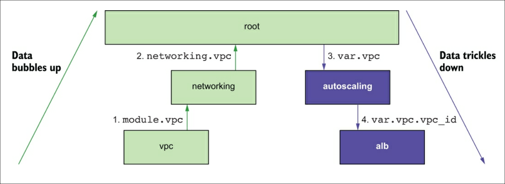

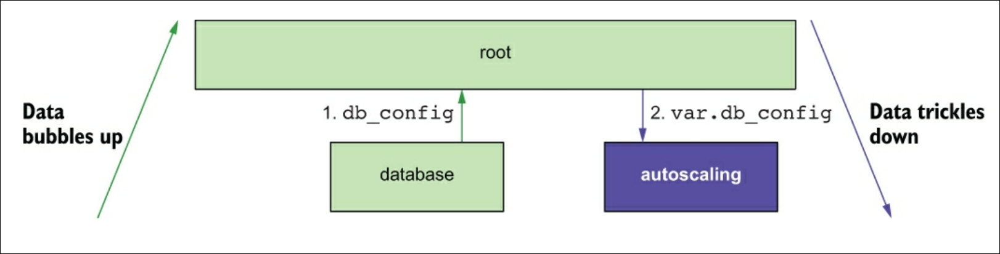

We need to update `main.tf` in the root module to trickle down data into the autoscaling module:

[Root module - main.tf](./ch04/three_tier/main.tf)
```hcl
module "autoscaling" {                             
  source      = "./modules/autoscaling"
  namespace   = var.namespace
  ssh_keypair = var.ssh_keypair                     

  vpc       = module.networking.vpc             # Input arguments set by other module's outputs
  sg        = module.networking.sg
  db_config = module.database.db_config
}

module "database" {
  source    = "./modules/database"
  namespace = var.namespace

  vpc = module.networking.vpc
  sg  = module.networking.sg
}

module "networking" {
  source    = "./modules/networking"
  namespace = var.namespace
}
```


The module's input variables are declared in `variables.tf`. We create a `./modules/autoscaling` directory and create the `variables.tf` file:

[Autoscaling module - variables.tf](./ch04/three_tier/modules/autoscaling/variables.tf)
```hcl
variable "namespace" {
  type = string
}

variable "ssh_keypair" {
  type = string
}

variable "vpc" {
  type = any
}

variable "sg" {
  type = any
}

variable "db_config" {
  type = object(                # Enforces strict type schema for the `db_config` object.
    {
      user     = string
      password = string
      database = string
      hostname = string
      port     = string
    }
  )
}
```

##### 4.6.2 Templating a `cloudinit_config`

The `cloudinit_config` data source is used to create user data fromteh launch template. The launch template is just a blueprint for the autoscaling group, as it bundles user data, the AMI ID, and other metadata.

The autoscaling group has a dependency on the load balancer because it needs to register itself as a target listener.


[Autoscaling module - main.tf]()
```hcl
module "iam_instance_profile" {
  source  = "terraform-in-action/iip/aws"
  actions = ["logs:*", "rds:*"]                         # The permissions are too open for production deployments, but good enough for dev
}

data "cloudinit_config" "config" {
  gzip          = true
  base64_encode = true
  part {
    content_type = "text/cloud-config"
    content      = templatefile("${path.module}/cloud_config.yaml", var.db_config)      # Content for the cloud init configuration comes from the template file
  }
}

data "aws_ami" "ubuntu" {
  most_recent = true
  filter {
    name   = "name"
    values = ["ubuntu/images/hvm-ssd/ubuntu-bionic-18.04-amd64-server-*"]
  }
  owners = ["099720109477"]
}

resource "aws_launch_template" "webserver" {
  name_prefix   = var.namespace
  image_id      = data.aws_ami.ubuntu.id
  instance_type = "t2.micro"
  user_data     = data.cloudinit_config.config.rendered
  key_name      = var.ssh_keypair
  iam_instance_profile {
    name = module.iam_instance_profile.name
  }
  vpc_security_group_ids = [var.sg.websvr]
}

resource "aws_autoscaling_group" "webserver" {
  name                = "${var.namespace}-asg"
  min_size            = 1
  max_size            = 3
  vpc_zone_identifier = var.vpc.private_subnets
  target_group_arns   = module.alb.target_group_arns
  launch_template {
    id      = aws_launch_template.webserver.id
    version = aws_launch_template.webserver.latest_version
  }
}

module "alb" {
  source             = "terraform-aws-modules/alb/aws"
  version            = "~> 5.0"
  name               = var.namespace
  load_balancer_type = "application"
  vpc_id             = var.vpc.vpc_id
  subnets            = var.vpc.public_subnets
  security_groups    = [var.sg.lb]

  http_tcp_listeners = [
    {
      port               = 80,                                  # Listens on port 80 and NATs to 8080
      protocol           = "HTTP"
      target_group_index = 0
    }
  ]

  target_groups = [
    { name_prefix      = "websvr",
      backend_protocol = "HTTP",
      backend_port     = 8080
      target_type      = "instance"
    }
  ]
}
```

More about the following line under `cloudinit_config`:  `templatefile("${path.module}/cloud_config.yaml", var.db_config)`

The cloud init configuration uses the `templatefile()` function. The result of this function is passed into the `cloudinit_config` data source and then used to configure the `aws_launch_template` resource.

[Autoscaling module - cloud_config.yaml](./ch04/three_tier/modules/autoscaling/cloud_config.yaml)
```yaml
#cloud-config
write_files:
  -   path: /etc/server.conf
      owner: root:root
      permissions: "0644"
      content: |
        {
          "user":  "${user}",
          "password": "${password}",
          "database": "${database}",
          "netloc": "${hostname}:${port}"
        }
runcmd:
  - curl -sL https://api.github.com/repos/scottwinkler/vanilla-webserver-src/releases/latest | jq -r ".assets[].browser_download_url" | wget -qi - 
  - unzip deployment.zip
  - ./deployment/server
packages:
  - jq
  - wget
  - unzip
```

This cloud init file installs some packages, creates a configuration file, and fetches application code (deployment.zip).

Finally, the output of the module is `lb_dns_name`, which is bubbled up to the root module.:

[Autoscaling module - outputs.tf](./ch04/three_tier/modules/autoscaling/outputs.tf)
```hcl
output "lb_dns_name" {
  value = module.alb.this_lb_dns_name
}
```

We also update the root module to include a reference to this output:

[Root module - outputs.tf](./ch04/three_tier/outputs.tf)
```hcl
output "db_password" {
  value = module.database.db_config.password
  sensitive = true 
}

output "lb_dns_name" {
  value = module.autoscaling.lb_dns_name
}
```

#### 4.7 Deploying the web application

Here is a look at the final directory structure:

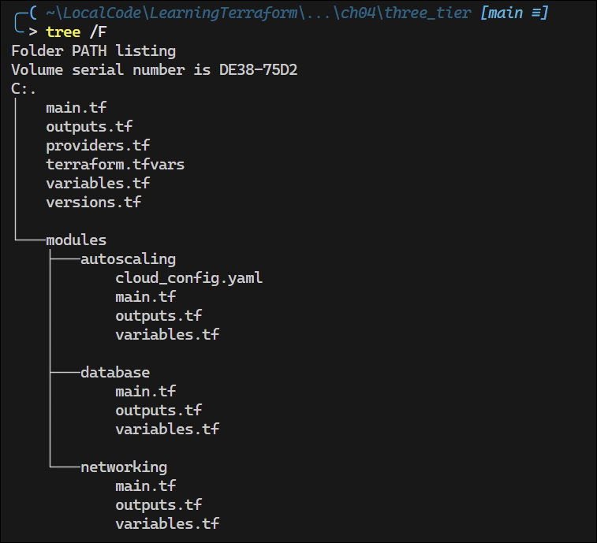

Before deploying, check your AWS credentials by running `aws configure`:

```powershell
╭─( ~\LocalCode\LearningTerraform\...\ch04\three_tier [main ≡ +1 ~2 -0 !]
╰╴> aws configure
AWS Access Key ID [None]: ***************************
AWS Secret Access Key [None]: ***************************
Default region name [None]: us-west-2
Default output format [None]: 
```

Next, run `terraform init` to download the required providers and modules, followed by `terraform apply` to deploy the infrastructure.

**Note:** I received the following error:

```powershell
│ Error: Your query returned no results. Please change your search criteria and try again.
│
│   with module.autoscaling.data.aws_ami.ubuntu,
│   on modules\autoscaling\main.tf line 15, in data "aws_ami" "ubuntu":
│   15: data "aws_ami" "ubuntu" {
```

This error refers to the following code in `main.tf`, indicating the AWS image can't be found:

```hcl
data "aws_ami" "ubuntu" {
  most_recent = true
  filter {
    name   = "name"
    values = ["ubuntu/images/hvm-ssd/ubuntu-bionic-18.04-amd64-server-*"]
  }
  owners = ["099720109477"]
}
```

I ran the following command to find the latest Ubuntu AMI ID:

```powershell
aws ec2 describe-images ` 
  --owners 099720109477 `
  --filters Name=name,Values='ubuntu/images/hvm-ssd/ubuntu-*' `
  --query 'Images[*].[Name,ImageId]' `
  --region us-west-2
```

The results of the command show that the `bionic` image is no longer available, so I chose the closest available image, which is `ubuntu/images/hvm-ssd/ubuntu-focal-20.04-amd64-server-20250603`.

After re-running `terraform apply`, I encountered two more errorsafter kicking off the deployment:

```powershell
│ Error: Error creating DB Instance: InvalidParameterCombination: RDS does not support creating a DB instance with the following combination: DBInstanceClass=db.t2.micro, Engine=mysql, EngineVersion=8.0.41, LicenseModel=general-public-license. For supported combinations of instance class and database engine version, see the documentation.
│       status code: 400, request id: 731e728e-23be-443b-91ba-87451f8478ee
│
│   with module.database.aws_db_instance.database,
│   on modules\database\main.tf line 7, in resource "aws_db_instance" "database":
│    7: resource "aws_db_instance" "database" {
│
╵
╷
│ Error: failed creating IAM Role (terraform-20250729094623111900000001): AccessDenied: User: arn:aws:iam::194903044381:user/gtate is not authorized to perform: iam:CreateRole on resource: arn:aws:iam::194903044381:role/terraform-20250729094623111900000001 because no identity-based policy allows the iam:CreateRole action
│       status code: 403, request id: 90acc6e1-6a7d-4c54-940d-9524afd7e55a
│
│   with module.autoscaling.module.iam_instance_profile.aws_iam_role.iam_role,
│   on .terraform\modules\autoscaling.iam_instance_profile\main.tf line 5, in resource "aws_iam_role" "iam_role":
│    5: resource "aws_iam_role" "iam_role" {
```

To remedy the first error, I ran the following query and noticed that the `db.t2.micro` instance class is no longer avaialble, so I changed the instance class to `db.t3.micro` in `modules/database/main.tf`:

```powershell
╭─( ~
╰╴> $results = aws rds describe-orderable-db-instance-options `
>>   --engine mysql `
>>   --engine-version 8.0.41 `
>>   --region us-west-2 `
>>   --query "OrderableDBInstanceOptions[*].DBInstanceClass"

╭─( ~
╰╴> $results | convertfrom-json | ? {$_ -match 'db.t.*micro$'}
db.t3.micro
db.t3.micro
db.t3.micro
db.t3.micro
db.t3.micro
db.t4g.micro
db.t4g.micro
db.t4g.micro
db.t4g.micro
db.t4g.micro
```

To remedy the second error, I updated permissions for my AWS login.

After running `terraform apply` again, and about 20 minutes later, the deployment completed successfully:

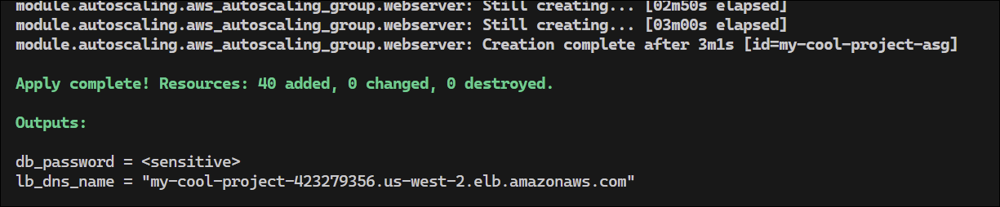

And the site responds over the Internet!

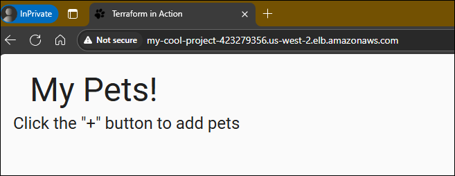

Then run `terraform destroy -auto-approve` to tear down the infrastructure.

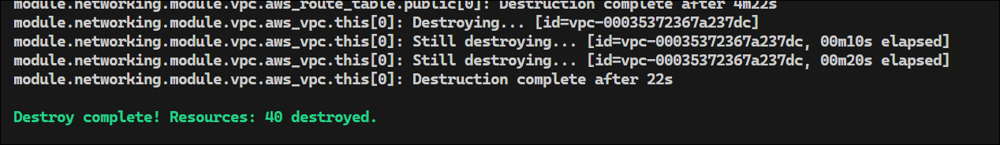

## Part 2: Terraform in the wild

Now the fun begins—depending on your idea of fun.
The next few chapters cover real-world Terraform design patterns for AWS, GCP, and Azure. Part 2 ends with an ambitious multi-cloud deployment that showcases Terraform’s full potential. Even if you’re unfamiliar with some clouds, the skills you gain will apply everywhere.

Chapter 5 introduces Azure and emerging technologies. You’ll design and deploy a serverless web application with Terraform. By the end, you’ll feel confident writing Terraform configurations, even unconventional ones.

Chapter 6 covers Terraform’s ecosystem and best practices. You’ll learn how to manage remote state storage, publish modules to the Terraform Registry, and understand where services like Terraform Cloud and Terraform Enterprise fit.

Chapter 7 dives into Kubernetes and GCP. You’ll deploy and test a CI/CD pipeline for containerized applications and explore tricks using local-exec provisioners.

Chapter 8 brings AWS, GCP, and Azure together. You’ll try approaches ranging from a simple multi-cloud load balancer to orchestrating and federating multiple Nomad and Consul clusters. The goal is to leave you with a sense of awe—and the knowledge that Terraform can handle almost anything.


### Chapter 5: Serverless made easy

This chapter covers:

* Deploying a serverless web application in Azure
* Understanding design patterns for Terraform modules
* Downloading arbitrary code with Terraform
* Combining Terraform with Azure Resource Manager (ARM)

“Serverless” is often overused as a marketing term, despite no clear consensus on its meaning. It doesn’t mean the absence of servers—distributed systems often use more servers than traditional designs.

Serverless is not a single technology but a set of related ones with two main traits:

* Pay-as-you-go billing — You pay for actual resource consumption, not pre-purchased capacity.
* Minimal operational overhead — The cloud provider handles scaling, maintenance, and management.

The main benefit is reduced workload for you, with the tradeoff of less control. On-premises data centers require the most work and give the most control. SaaS requires the least work and offers the least control. Serverless sits between these, leaning closer to SaaS.

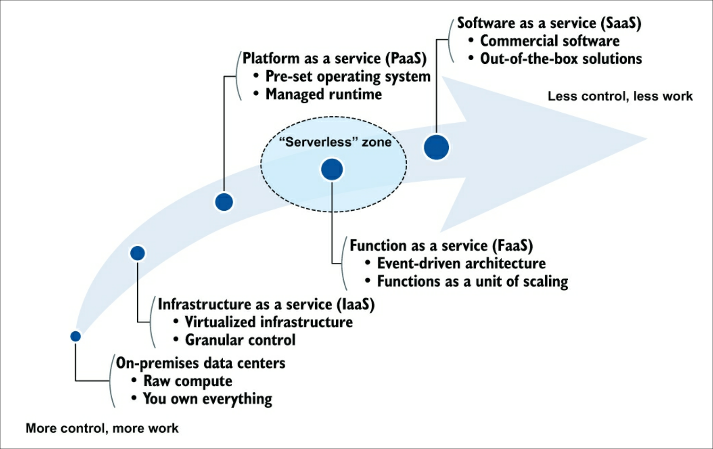

In this chapter, we deploy an Azure Functions website with Terraform. Azure Functions is a serverless technology, like AWS Lambda or Google Cloud Functions, that lets you run code without managing servers.

Our architecture will resemble the web app from chapter 4 but in a serverless form.

Functions are atomic—the smallest unit of logic in programming, created by breaking a monolith into its basic parts. They are easy to test and scale, making them well-suited for serverless applications. The tradeoff is that their stateless and highly compartmentalized nature requires more connections and integration between components.

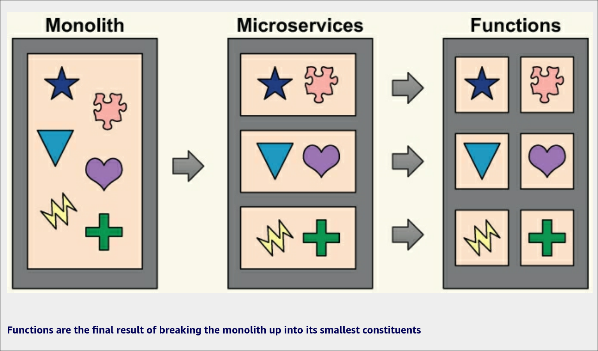

#### 5.1 The "two-penny website"

I call this scenario “the two-penny website” because it costs about that much to run each month. A year of hosting could be covered by spare change from your sofa cushions. For most low-traffic sites, the cost may be even lower—sometimes effectively zero.

The site is a ballroom dancing forum called *Ballroom Dancers Anonymous*. Unauthenticated users can post public comments, which are displayed on the site and stored in a database. The simple design makes it easy to adapt for other applications. Figure 5.2 shows a preview of the final product.


We will use Azure to deploy the serverless website, but it shouldn’t feel any different than deploying to AWS. A basic deployment strategy is shown in figure 5.3.

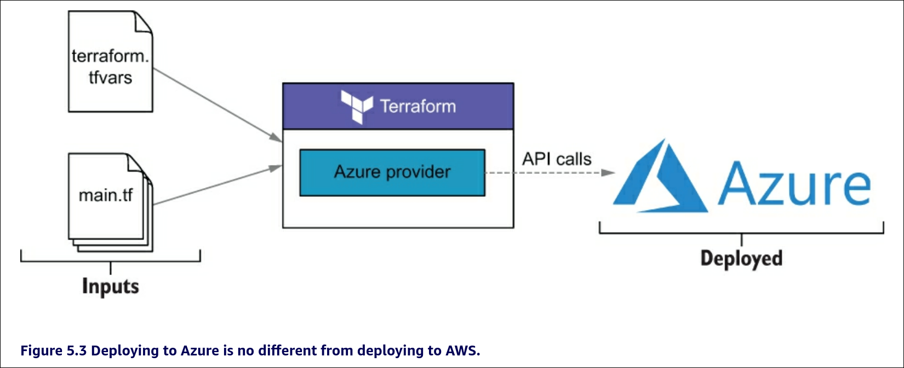

#### 5.2 Architecture and planning

Despite costing only pennies to run, this website is far from a toy. Running on Azure Functions allows it to scale quickly to handle large traffic spikes with low latency. It also uses HTTPS, a NoSQL database, and serves both static content (HTML/CSS/JS) and a REST API. Figure 5.4 shows the architecture diagram.

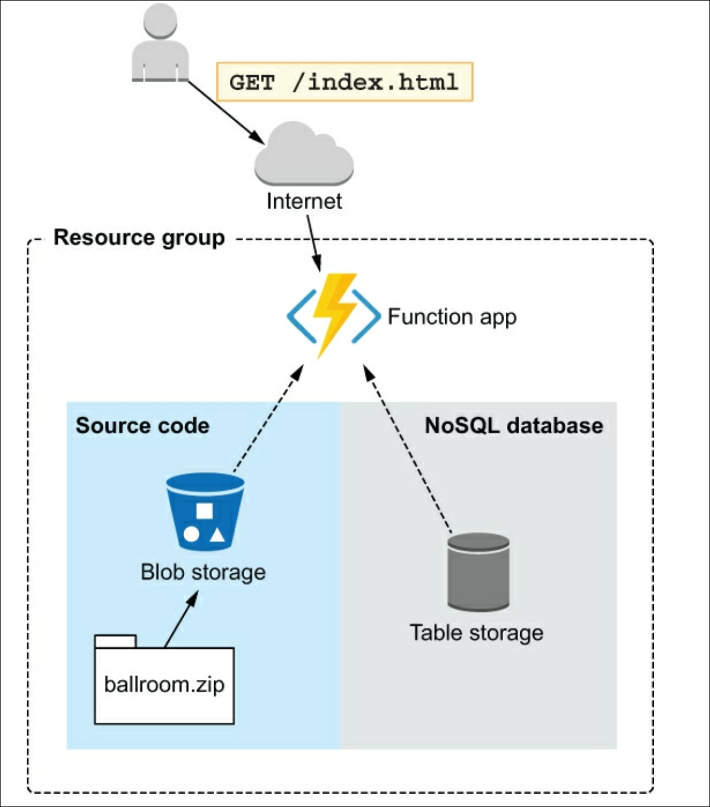

##### 5.2.1 Sorting by group and then by size

Since the code is short and cohesive, it’s best to keep everything in a single main.tf file rather than using nested modules.

**Tip:** As a general rule, keep Terraform files under a few hundred lines. Beyond that, it becomes harder to maintain a clear mental model of the code. The exact limit is up to you.

Without nested modules, code can still be organized for clarity. As covered in chapter 4, placing resources with fewer dependencies toward the top of the file, and those with more dependencies toward the bottom, is a good approach. The challenge comes when two resources have the same number of dependencies, which can introduce ambiguity.

Grouping resources that “belong together” means organizing them based on their natural relationships, not just their dependency count.

Sorting purely by dependencies can be limiting. For example, if you had a bag of multicolored marbles, ordering them from smallest to largest wouldn’t help you find a specific color. A better method would be to first group by color, then sort each group by size, and finally arrange the groups so the overall order still follows increasing size.

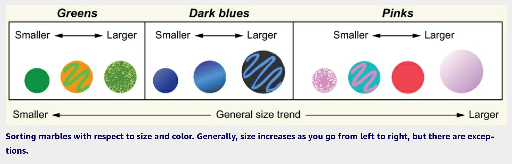

Organizing by characteristics other than dependency count—referred to here as “size”—is a common practice for writing clean Terraform code. The approach is to first group related resources, then sort each group by size, and finally arrange the groups so the overall order still follows increasing size. This keeps the code both readable and easy to understand.

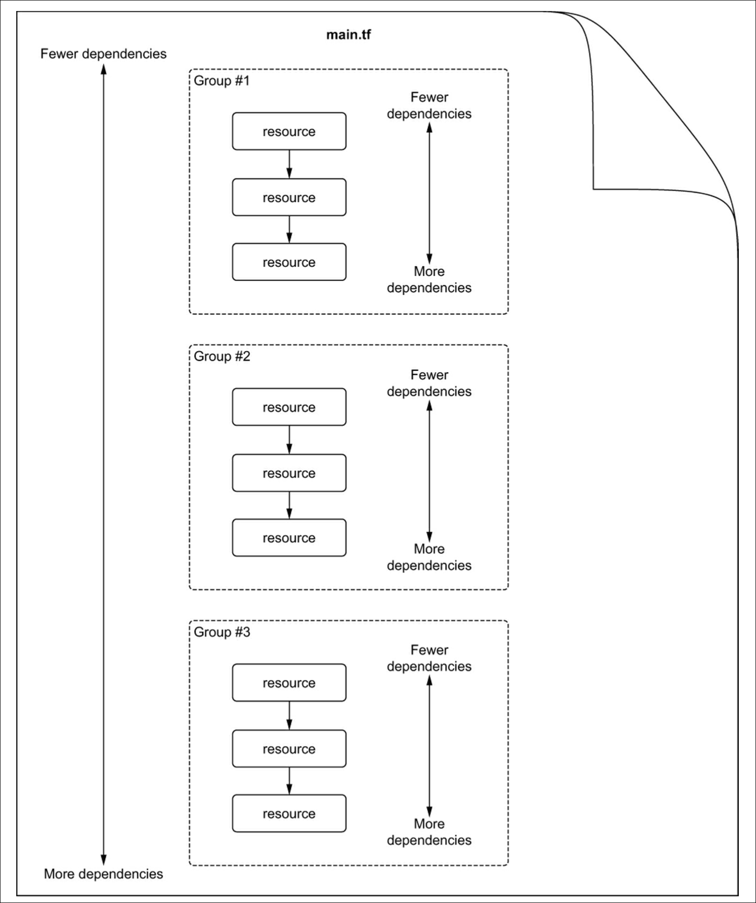

Just as it’s easier to find a word in a dictionary than in a word-search puzzle, it’s quicker to locate what you need when your code is organized logically, such as the sorting pattern in figure 5.5.

This project is divided into four groups, each with a distinct role in the deployment:

* **Resource group** — An Azure resource that acts as a project container. It and other base-level resources go at the top of main.tf since they have no dependencies.
* **Storage container** — Like an S3 bucket, it stores the versioned build artifact (source code) used by Azure Functions and also functions as the NoSQL database.
* **Storage blob** — Similar to an S3 object, it is uploaded to the storage container.
* **Azure Functions app** — All resources related to deploying and configuring the Azure Functions app.

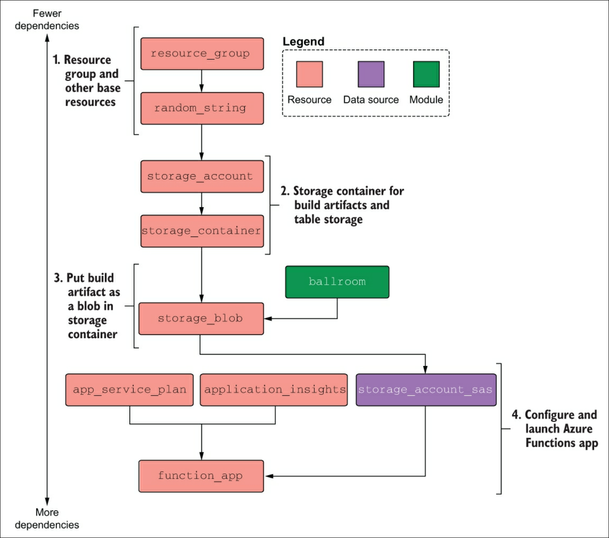

Finally, we define inputs and outputs.

There are two input variables:

* **location** — Specifies the Azure region.
* **namespace** — Ensures a consistent naming scheme.

The single output is **website\_url**, which links to the deployed website (see figure 5.7).

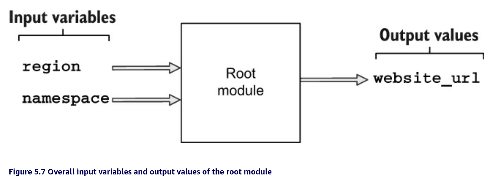

#### 5.3 Writing the code

We need to create four groups:

* Resource group
* Storage container
* Storage blob
* Azure Functions app

Before writing the code, authenticate to Microsoft Azure and set the required input variables. 


After authenticating to Azure, create a workspace with three files: variables.tf, terraform.tfvars, and providers.tf.

Add to variables.tf:

[variables.tf](./ch05/Two-Penny-Website/variables.tf)
```hcl
variable "location" {
  type    = string
  default = "westus2"
}

variable "namespace" {
  type    = string
  default = "ballroominaction"
}
```
Set variables in terraform.tfvars (defaults are fine, but we’ll be explicit):

[terraform.tfvars](./ch05/Two-Penny-Website/terraform.tfvars)
```hcl
location  = "westus2"
namespace = "ballroominaction"
```
Declare the Azure provider in providers.tf (empty when using CLI auth):

[providers.tf](./ch05/Two-Penny-Website/providers.tf)
```hcl
provider "azurerm" {
  features {}
}
```

Tip: never hardcode secrets in Terraform. Keep sensitive data out of version control. (See chapters 6 and 13 for secret management.)

##### 5.3.1 Resource group

We’ll start with the first group: the resource group.

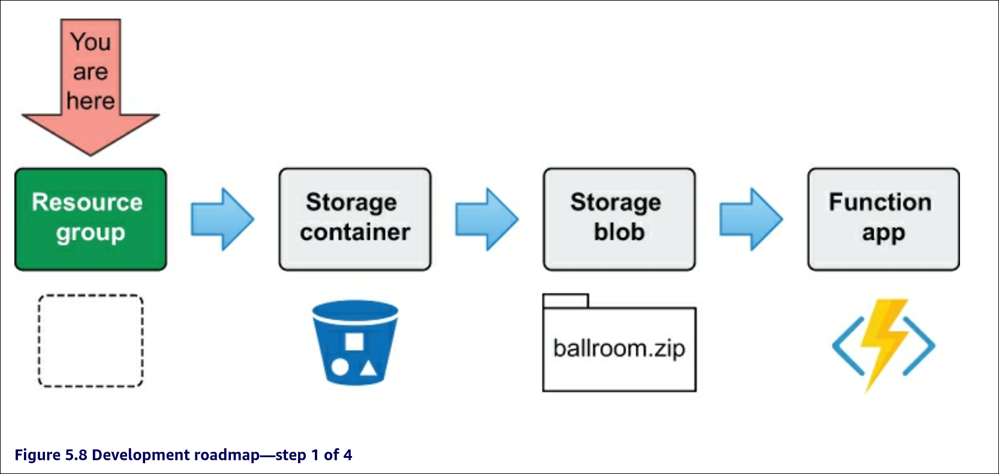

In Azure, every resource must live in a resource group—a container for related resources. Deleting the group deletes everything inside. Give each Terraform deployment its own group to keep resources organized. AWS and GCP have similar concepts, but only Azure requires it.

Create the resource group:

[main.tf](./ch05/Two-Penny-Website/main.tf)
```hcl
resource "azurerm_resource_group" "default" {
  name     = local.namespace
  location = var.location
}
```

Some Azure resources must be globally unique. Add extra randomness to the namespace by appending a random suffix, then truncate to a safe length. Place this before the resource group so the dependency is clear:

[main.tf](./ch05/Two-Penny-Website/main.tf)
```hcl
resource "random_string" "rand" {
  length  = 24
  special = false
  upper   = false
}

locals {
  namespace = substr(join("-", [var.namespace, random_string.rand.result]), 0, 24)			// Right-pad namespace with randomness; store as local
}
```

##### 5.3.2 Storage container

Next, we’ll use an Azure storage container to store the application’s source code and documents in a NoSQL database (see figure 5.9).

The NoSQL database is technically a separate service—Azure Table Storage—but it’s essentially a NoSQL wrapper around standard key-value pairs.

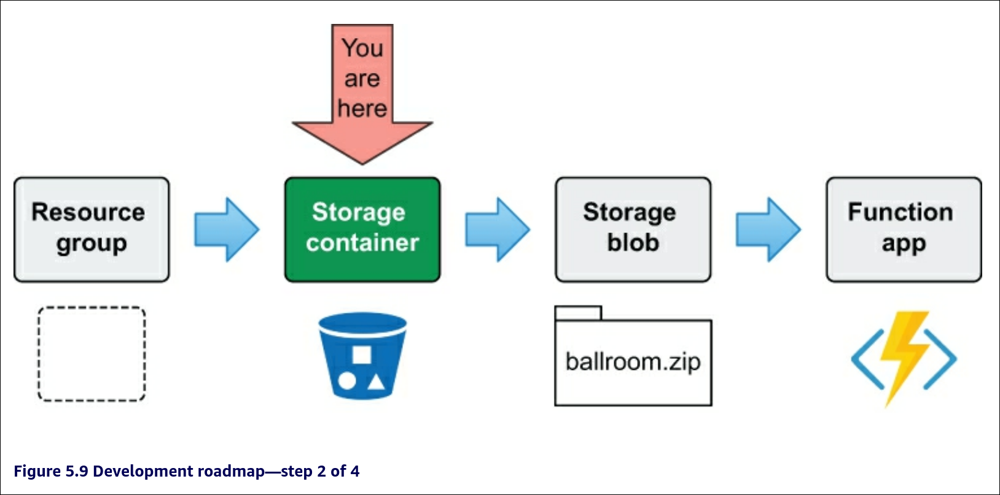

Provisioning a container in Azure takes two steps:

1. Create a **storage account**, which defines where the data is stored and its replication settings. Standard values balance cost and durability.
2. Create the **storage container** itself.

Here’s the code for both:

[main.tf](./ch05/Two-Penny-Website/main.tf)
```hcl
resource "azurerm_storage_account" "storage_account" {
  name                     = random_string.rand.result
  resource_group_name      = azurerm_resource_group.default.name
  location                 = azurerm_resource_group.default.location
  account_tier             = "Standard"
  account_replication_type = "LRS"
}

resource "azurerm_storage_container" "storage_container" {
  name                  = "serverless"
  storage_account_name  = azurerm_storage_account.storage_account.name
  container_access_type = "private"
}
```

**Note:** Azure Storage can host static websites and serve as a CDN, but the Azure provider doesn’t currently support configuring this directly. Workarounds exist using `local-exec` provisioners, but these aren’t best practice. Chapter 7 covers provisioners in detail. In this project, Azure Functions will serve both the static content and the REST API.

##### 5.3.3 Storage blob

One thing that's nice about Azure Functions is the variety of deployment options. For example, you can:

* Use the Azure Functions CLI tool.
* Edit the code manually in the UI.
* Use the VS Code extension.
* Run from a zip package via a publicly accessible URL.

For this scenario, we’ll use the last option because it lets us deploy the project with a single `terraform apply` command. The next step is to upload a storage blob to the container (see figure 5.10).

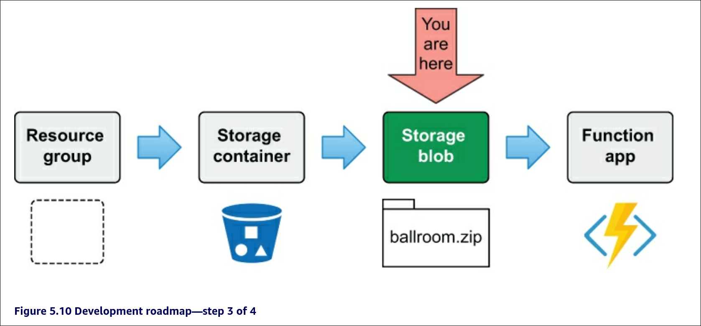

You might be wondering where the source code zip file comes from. Normally, you’d already have it locally or download it before Terraform runs as part of a CI/CD pipeline.

To avoid extra steps, the author packaged the zip file into a Terraform module. Remote modules can be fetched from the Terraform Registry using either `terraform init` or `terraform get`. These commands download not just the configuration, but everything in the module.

The author stored the entire application source code in a shim module so it’s downloaded automatically with `terraform init`. Figure 5.11 shows this setup.

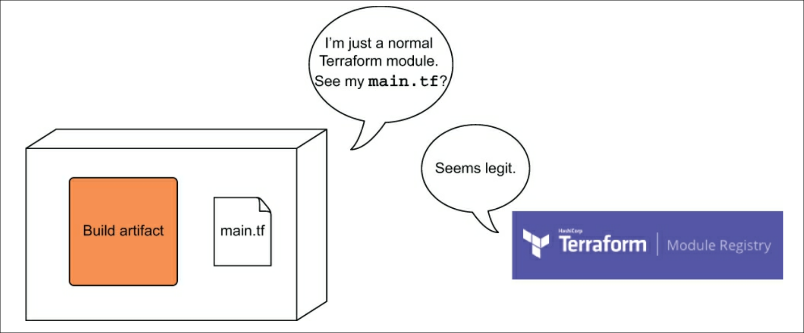

**WARNING:** Modules can run malicious code locally by using `local-exec` provisioners. Always review the source of any untrusted module before deploying.

The shim module here is used to download the build artifact to your local machine. This isn’t best practice, but it’s a useful shortcut for our example.

Add the following to `main.tf`:

```hcl
module "ballroom" {
  source = "terraform-in-action/ballroom/azure"
}

resource "azurerm_storage_blob" "storage_blob" {
  name                   = "server.zip"
  storage_account_name   = azurerm_storage_account.storage_account.name
  storage_container_name = azurerm_storage_container.storage_container.name
  type                   = "Block"
  source                 = module.ballroom.output_path
}
```

##### 5.3.4 Function app

Next, we’ll write the code for the function app (figure 5.12). Unfortunately, it’s not entirely straightforward. The function app must download the application source code from the private storage container, which requires a URL signed with a shared access signature (SAS) token.


Terraform provides a data source for generating SAS tokens, though it’s more verbose than ideal. The example below creates a SAS token granting read-only access to a specific blob, with an expiry date in 2048 (needed because Azure Functions uses it continuously).

[main.tf](./ch05/Two-Penny-Website/main.tf)
```hcl
data "azurerm_storage_account_sas" "storage_sas" {
  connection_string = azurerm_storage_account.storage_account.primary_connection_string

  resource_types {
    service   = false
    container = false
    object    = true
  }

  services {
    blob  = true
    queue = false
    table = false
    file  = false
  }

  start  = "2016-06-19T00:00:00Z"
  expiry = "2048-06-19T00:00:00Z"

  permissions {
    read    = true        # Read-only access to blobs
    write   = false
    delete  = false
    list    = false
    add     = false
    create  = false
    update  = false
    process = false
    tag     = false
    filter  = false
  }
}
```

Terraform doesn’t have a built-in way to generate a presigned URL, so we set it manually as a local variable:

[main.tf](./ch05/Two-Penny-Website/main.tf)
```hcl
locals {
  package_url = "https://${azurerm_storage_account.storage_account.name}.blob.core.windows.net/${azurerm_storage_container.storage_container.name}/${azurerm_storage_blob.storage_blob.name}${data.azurerm_storage_account_sas.storage_sas.sas}"
}
```

Next, create the App Service plan, Application Insights resource, and Function App:

[main.tf](./ch05/Two-Penny-Website/main.tf)
```hcl
resource "azurerm_app_service_plan" "plan" {
  name                = local.namespace
  location            = azurerm_resource_group.default.location
  resource_group_name = azurerm_resource_group.default.name
  kind                = "functionapp"
  sku {
    tier = "Dynamic"
    size = "Y1"
  }
}

resource "azurerm_application_insights" "application_insights" {
  name                = local.namespace
  location            = azurerm_resource_group.default.location
  resource_group_name = azurerm_resource_group.default.name
  application_type    = "web"
}

resource "azurerm_function_app" "function" {
  name                = local.namespace
  location            = azurerm_resource_group.default.location
  resource_group_name = azurerm_resource_group.default.name
  app_service_plan_id = azurerm_app_service_plan.plan.id
  https_only          = true

  storage_account_name       = azurerm_storage_account.storage_account.name
  storage_account_access_key = azurerm_storage_account.storage_account.primary_access_key
  version                    = "~2"

  app_settings = {
    FUNCTIONS_WORKER_RUNTIME       = "node"
    WEBSITE_RUN_FROM_PACKAGE       = local.package_url
    WEBSITE_NODE_DEFAULT_VERSION   = "10.14.1"
    APPINSIGHTS_INSTRUMENTATIONKEY = azurerm_application_insights.application_insights.instrumentation_key
    TABLES_CONNECTION_STRING       = data.azurerm_storage_account_sas.storage_sas.connection_string
    AzureWebJobsDisableHomepage    = true
  }
}
```

##### 5.3.5 Final touches

We’re almost finished. The last tasks are to lock the provider versions and create an output for a quick link to the deployed site.

[versions.tf](./ch05/Two-Penny-Website/versions.tf)

```hcl
terraform {
  required_version = ">= 0.15"
  required_providers {
    azurerm = {
      source  = "hashicorp/azurerm"
      version = "~> 2.47"
    }
    archive = {
      source  = "hashicorp/archive"
      version = "~> 2.0"
    }
    random = {
      source  = "hashicorp/random"
      version = "~> 3.0"
    }
  }
}
```

[outputs.tf](./ch05/Two-Penny-Website/outputs.tf)

```hcl
output "website_url" {
  value = "https://${local.namespace}.azurewebsites.net/"
}
```
**Note:** You can declare local values at the top of the file or next to the resources that use them&mdash;either style works.

#### 5.4 Deploying to Azure

We’ve completed the four steps for setting up the Azure serverless project and can now deploy.

Run the following to initialize Terraform and check the configuration:

```bash
terraform init
terraform plan
```

```pwsh
terraform init

Initializing the backend...
Initializing modules...
Downloading registry.terraform.io/terraform-in-action/ballroom/azure 1.0.0 for ballroom...
- ballroom in .terraform\modules\ballroom
Initializing provider plugins...
- Finding hashicorp/random versions matching "~> 3.0"...
- Finding hashicorp/azurerm versions matching "~> 2.47"...
- Finding hashicorp/archive versions matching "~> 2.0"...
- Installing hashicorp/random v3.7.2...
- Installed hashicorp/random v3.7.2 (signed by HashiCorp)
- Installing hashicorp/azurerm v2.99.0...
- Installed hashicorp/azurerm v2.99.0 (signed by HashiCorp)
- Installing hashicorp/archive v2.7.1...
- Installed hashicorp/archive v2.7.1 (signed by HashiCorp)
Terraform has created a lock file .terraform.lock.hcl to record the provider
selections it made above. Include this file in your version control repository
so that Terraform can guarantee to make the same selections by default when
you run "terraform init" in the future.

Terraform has been successfully initialized!

You may now begin working with Terraform. Try running "terraform plan" to see
any changes that are required for your infrastructure. All Terraform commands
should now work.

If you ever set or change modules or backend configuration for Terraform,
rerun this command to reinitialize your working directory. If you forget, other
commands will detect it and remind you to do so if necessary.
```
<details>
<summary>terraform plan output</summary>

```pwsh
terraform plan

module.ballroom.data.archive_file.code_package: Reading...
module.ballroom.data.archive_file.code_package: Read complete after 1s [id=49183daed0ea5fa5dd9bcfa243676c338f748ffa]

Terraform used the selected providers to generate the following execution plan. Resource actions are indicated with the following symbols:
  + create
 <= read (data resources)

Terraform will perform the following actions:

  # data.azurerm_storage_account_sas.storage_sas will be read during apply
  # (config refers to values not yet known)
 <= data "azurerm_storage_account_sas" "storage_sas" {
      + connection_string = (sensitive value)
      + expiry            = "2048-06-19T00:00:00Z"
      + id                = (known after apply)
      + sas               = (sensitive value)
      + start             = "2016-06-19T00:00:00Z"

      + permissions {
          + add     = false
          + create  = false
          + delete  = false
          + list    = false
          + process = false
          + read    = true
          + update  = false
          + write   = false
        }

      + resource_types {
          + container = false
          + object    = true
          + service   = false
        }

      + services {
          + blob  = true
          + file  = false
          + queue = false
          + table = false
        }
    }

  # azurerm_app_service_plan.plan will be created
  + resource "azurerm_app_service_plan" "plan" {
      + id                           = (known after apply)
      + kind                         = "functionapp"
      + location                     = "westus2"
      + maximum_elastic_worker_count = (known after apply)
      + maximum_number_of_workers    = (known after apply)
      + name                         = (known after apply)
      + resource_group_name          = (known after apply)

      + sku {
          + capacity = (known after apply)
          + size     = "Y1"
          + tier     = "Dynamic"
        }
    }

  # azurerm_application_insights.application_insights will be created
  + resource "azurerm_application_insights" "application_insights" {
      + app_id                                = (known after apply)
      + application_type                      = "web"
      + connection_string                     = (sensitive value)
      + daily_data_cap_in_gb                  = (known after apply)
      + daily_data_cap_notifications_disabled = (known after apply)
      + disable_ip_masking                    = false
      + force_customer_storage_for_profiler   = false
      + id                                    = (known after apply)
      + instrumentation_key                   = (sensitive value)
      + internet_ingestion_enabled            = true
      + internet_query_enabled                = true
      + local_authentication_disabled         = false
      + location                              = "westus2"
      + name                                  = (known after apply)
      + resource_group_name                   = (known after apply)
      + retention_in_days                     = 90
      + sampling_percentage                   = 100
    }

  # azurerm_function_app.function will be created
  + resource "azurerm_function_app" "function" {
      + app_service_plan_id             = (known after apply)
      + app_settings                    = (known after apply)
      + client_affinity_enabled         = (known after apply)
      + custom_domain_verification_id   = (known after apply)
      + default_hostname                = (known after apply)
      + enable_builtin_logging          = true
      + enabled                         = true
      + https_only                      = true
      + id                              = (known after apply)
      + key_vault_reference_identity_id = (known after apply)
      + kind                            = (known after apply)
      + location                        = "westus2"
      + name                            = (known after apply)
      + outbound_ip_addresses           = (known after apply)
      + possible_outbound_ip_addresses  = (known after apply)
      + resource_group_name             = (known after apply)
      + site_credential                 = (known after apply)
      + storage_account_access_key      = (sensitive value)
      + storage_account_name            = (known after apply)
      + storage_connection_string       = (sensitive value)
      + version                         = "~2"

      + auth_settings (known after apply)

      + connection_string (known after apply)

      + identity (known after apply)

      + site_config (known after apply)

      + source_control (known after apply)
    }

  # azurerm_resource_group.default will be created
  + resource "azurerm_resource_group" "default" {
      + id       = (known after apply)
      + location = "westus2"
      + name     = (known after apply)
    }

  # azurerm_storage_account.storage_account will be created
  + resource "azurerm_storage_account" "storage_account" {
      + access_tier                       = (known after apply)
      + account_kind                      = "StorageV2"
      + account_replication_type          = "LRS"
      + account_tier                      = "Standard"
      + allow_blob_public_access          = false
      + enable_https_traffic_only         = true
      + id                                = (known after apply)
      + infrastructure_encryption_enabled = false
      + is_hns_enabled                    = false
      + large_file_share_enabled          = (known after apply)
      + location                          = "westus2"
      + min_tls_version                   = "TLS1_0"
      + name                              = (known after apply)
      + nfsv3_enabled                     = false
      + primary_access_key                = (sensitive value)
      + primary_blob_connection_string    = (sensitive value)
      + primary_blob_endpoint             = (known after apply)
      + primary_blob_host                 = (known after apply)
      + primary_connection_string         = (sensitive value)
      + primary_dfs_endpoint              = (known after apply)
      + primary_dfs_host                  = (known after apply)
      + primary_file_endpoint             = (known after apply)
      + primary_file_host                 = (known after apply)
      + primary_location                  = (known after apply)
      + primary_queue_endpoint            = (known after apply)
      + primary_queue_host                = (known after apply)
      + primary_table_endpoint            = (known after apply)
      + primary_table_host                = (known after apply)
      + primary_web_endpoint              = (known after apply)
      + primary_web_host                  = (known after apply)
      + queue_encryption_key_type         = "Service"
      + resource_group_name               = (known after apply)
      + secondary_access_key              = (sensitive value)
      + secondary_blob_connection_string  = (sensitive value)
      + secondary_blob_endpoint           = (known after apply)
      + secondary_blob_host               = (known after apply)
      + secondary_connection_string       = (sensitive value)
      + secondary_dfs_endpoint            = (known after apply)
      + secondary_dfs_host                = (known after apply)
      + secondary_file_endpoint           = (known after apply)
      + secondary_file_host               = (known after apply)
      + secondary_location                = (known after apply)
      + secondary_queue_endpoint          = (known after apply)
      + secondary_queue_host              = (known after apply)
      + secondary_table_endpoint          = (known after apply)
      + secondary_table_host              = (known after apply)
      + secondary_web_endpoint            = (known after apply)
      + secondary_web_host                = (known after apply)
      + shared_access_key_enabled         = true
      + table_encryption_key_type         = "Service"

      + blob_properties (known after apply)

      + customer_managed_key (known after apply)

      + network_rules (known after apply)

      + queue_properties (known after apply)

      + routing (known after apply)

      + share_properties (known after apply)
    }

  # azurerm_storage_blob.storage_blob will be created
  + resource "azurerm_storage_blob" "storage_blob" {
      + access_tier            = (known after apply)
      + content_type           = "application/octet-stream"
      + id                     = (known after apply)
      + metadata               = (known after apply)
      + name                   = "server.zip"
      + parallelism            = 8
      + size                   = 0
      + source                 = ".terraform/modules/ballroom/dist/server.zip"
      + storage_account_name   = (known after apply)
      + storage_container_name = "serverless"
      + type                   = "Block"
      + url                    = (known after apply)
    }

  # azurerm_storage_container.storage_container will be created
  + resource "azurerm_storage_container" "storage_container" {
      + container_access_type   = "private"
      + has_immutability_policy = (known after apply)
      + has_legal_hold          = (known after apply)
      + id                      = (known after apply)
      + metadata                = (known after apply)
      + name                    = "serverless"
      + resource_manager_id     = (known after apply)
      + storage_account_name    = (known after apply)
    }

  # random_string.rand will be created
  + resource "random_string" "rand" {
      + id          = (known after apply)
      + length      = 24
      + lower       = true
      + min_lower   = 0
      + min_numeric = 0
      + min_special = 0
      + min_upper   = 0
      + number      = true
      + numeric     = true
      + result      = (known after apply)
      + special     = false
      + upper       = false
    }

Plan: 8 to add, 0 to change, 0 to destroy.

Changes to Outputs:
  + website_url = (known after apply)

───────────────────────────────────────────────────────────────────────────────────────────────────────────────────────────────────────────────────────────────────────────────────────────────────────────────────────────────────────────────────────────────────────── 

Note: You didn't use the -out option to save this plan, so Terraform can't guarantee to take exactly these actions if you run "terraform apply" now.
```
</details>

Next, deploy with:

```bash
terraform apply -auto-approve
```

Note: It’s safer to run `terraform plan` first. The `-auto-approve` flag is used here only for brevity.

