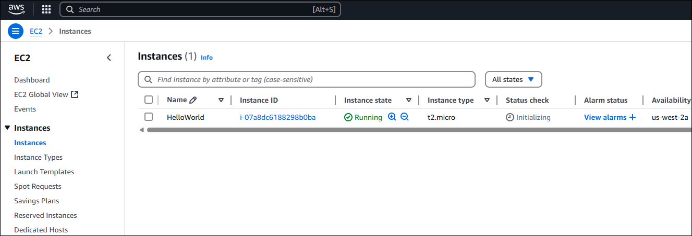
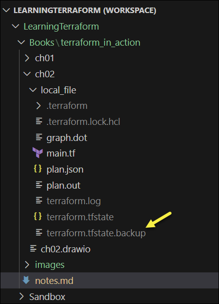
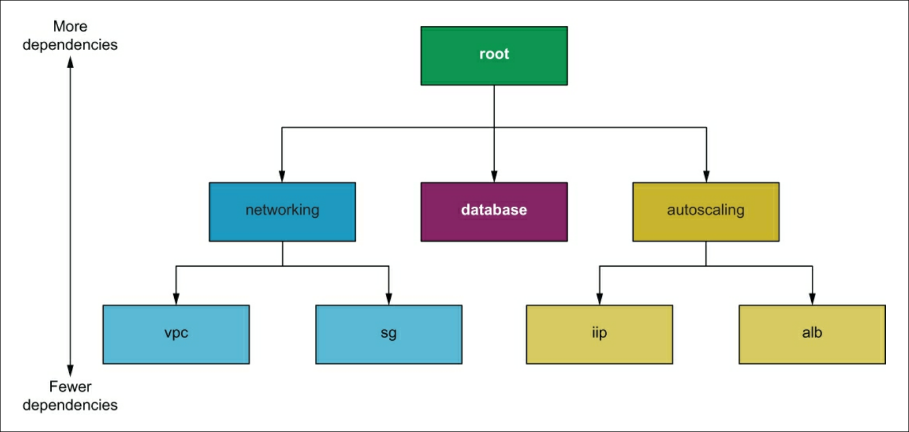

# My notes on "Terraform in Action" by Scott Winkler


<details>
<summary>Book Resources</summary>

- [Book Code](https://github.com/terraform-in-action/manning-code)

</details>

<!-- omit from toc -->
## Helpful Commands

```cmd
terraform init      # Initialize a working directory containing Terraform configuration files
terraform apply     # Create or update infrastructure as defined in the configuration files
terraform show      # Show the current state of the infrastructure managed by Terraform
terraform fmt       # Format Terraform configuration files to a canonical format and style
```

<!-- omit from toc -->
## Terraform Resources
- [Install Terraform](https://developer.hashicorp.com/terraform/tutorials/aws-get-started/install-cli)

<!-- omit from toc -->
## Contents

- [Part 1: Terraform Bootcamp](#part-1-terraform-bootcamp)
  - [Chapter 1: Getting Started with Terraform](#chapter-1-getting-started-with-terraform)
    - [1.2 Hello Terraform Example](#12-hello-terraform-example)
      - [1.2.1 Writing the Configuration](#121-writing-the-configuration)
      - [1.2.2 Configuring the AWS Provider](#122-configuring-the-aws-provider)
      - [1.2.3 Initializing Terraform](#123-initializing-terraform)
      - [1.2.4 Deploying the EC2 Instance](#124-deploying-the-ec2-instance)
      - [1.2.5 Destroying the EC2 Instance](#125-destroying-the-ec2-instance)
    - [1.3 Brave new "Hello Terraform"](#13-brave-new-hello-terraform)
  - [Chapter 2: Life Cycle of a Terraform Resource](#chapter-2-life-cycle-of-a-terraform-resource)
    - [2.1 Process Overview](#21-process-overview)
    - [2.1.1 Life cycle function hooks](#211-life-cycle-function-hooks)
    - [2.2 Declaring a local file resource](#22-declaring-a-local-file-resource)
    - [2.3 Initializing the workspace](#23-initializing-the-workspace)
    - [2.4 Generating an execution plan](#24-generating-an-execution-plan)
      - [Enabling Trace Logging](#enabling-trace-logging)
      - [Troubleshooting slow-running plans](#troubleshooting-slow-running-plans)
      - [Stages of `terraform plan`](#stages-of-terraform-plan)
      - [Generating a dependency graph](#generating-a-dependency-graph)
      - [Inspecting the plan using JSON](#inspecting-the-plan-using-json)
    - [2.5 Creating the local file resource](#25-creating-the-local-file-resource)
    - [2.6 Performing No-Op](#26-performing-no-op)
    - [2.7 Updating the local file resource](#27-updating-the-local-file-resource)
      - [2.7.1 Detecting configuration drift](#271-detecting-configuration-drift)
      - [Terraform refresh](#terraform-refresh)
    - [2.8 Deleting the local file resource](#28-deleting-the-local-file-resource)
  - [Chapter 3: Functional Programming](#chapter-3-functional-programming)
    - [3.1 Fun with Mad Libs](#31-fun-with-mad-libs)
      - [3.1.1 Input Variables](#311-input-variables)
      - [3.1.2 Assigning values with a variable definition file](#312-assigning-values-with-a-variable-definition-file)
      - [3.1.3 Validating variables](#313-validating-variables)
      - [3.1.4 Shuffling lists](#314-shuffling-lists)
      - [3.1.5 Functions](#315-functions)
      - [3.1.6 Output values](#316-output-values)
      - [3.1.7 Templates](#317-templates)
      - [3.1.8 Printing output](#318-printing-output)
    - [3.2 Generating many Mad Libs stories](#32-generating-many-mad-libs-stories)
      - [3.2.1 `for` expressions](#321-for-expressions)
      - [3.2.2 Local values](#322-local-values)
      - [3.2.4 `count` parameter](#324-count-parameter)
      - [3.2.5 Conditional expressions](#325-conditional-expressions)
      - [3.2.6 More templates](#326-more-templates)
      - [3.2.7 Local file](#327-local-file)
      - [3.2.8 Zipping files](#328-zipping-files)
      - [3.2.9 Applying changes](#329-applying-changes)
      - [Expressions Reference](#expressions-reference)
  - [Chapter 4: Deploying a multi-tiered web application in AWS](#chapter-4-deploying-a-multi-tiered-web-application-in-aws)
    - [4.1 Architecture](#41-architecture)
    - [4.2 Terraform modules](#42-terraform-modules)
      - [4.2.1 Module syntax](#421-module-syntax)
      - [4.2.2 What is the root module?](#422-what-is-the-root-module)
      - [4.2.3 Standard module structure](#423-standard-module-structure)


## Part 1: Terraform Bootcamp

### Chapter 1: Getting Started with Terraform

#### 1.2 Hello Terraform Example

**Scenario**: Use Terraform to deploy a virtual machine (EC2 instance) on AWS.


The sequence of steps to deploy the EC2 instance using Terraform:


##### 1.2.1 Writing the Configuration

The HashiCorp Configuration Language (HCL)  is used to declare an aws_instance resource in a Terraform configuration file. The configuration file is a text file with a `.tf` extension. The file contains the following code:
```hcl
resource "aws_instance" "helloworld" {
  ami           = "ami-09dd2e08d601bff67"
  instance_type = "t2.micro"
  tags = {
    Name = "HelloWorld"
  }
}
```
The first line declares a resource and exactly two labels, the first is the type of resource (aws_instance) and the second is a name for the resource (helloworld). Together the type and name form a unique identifier for the resource.


The remaining lines of the resource block are called arguments.


##### 1.2.2 Configuring the AWS Provider

Providers can be either `aws`, `azurerm`, or `google`. 

```hcl
provider "aws" {
    region = "us-west-2"
}

resource "aws_instance" "helloworld" {
  ami           = "ami-09dd2e08d601bff67"
  instance_type = "t2.micro"
  tags = {
    Name = "HelloWorld"
  }
}
```
Things to note:
- Providers only have inputs, no outputs.


##### 1.2.3 Initializing Terraform

Run `terraform init` to initialize Terraform and download the AWS provider plugin:  


##### 1.2.4 Deploying the EC2 Instance

Run `terraform apply` to create the EC2 instance. Terraform will prompt for confirmation before proceeding with the deployment. After confirming, Terraform will create the EC2 instance and display the output.


After configuring AWS credentials...


Confirm resource creation: 



Information about the created resource is stored in the Terraform state file with the `.tfstate` extension:


> IMPORTANT: Do not manuaually edit or delete the `.tfstate` file. Terraform uses this file to keep track of the resources it manages. If you edit or delete it, Terraform may lose track of the resources and cause issues in future operations.

Use `terraform show` to display the current state of the infrastructure managed by Terraform. This command will show the details of the EC2 instance created in the previous step.


##### 1.2.5 Destroying the EC2 Instance

Run `terraform destroy` to remove the EC2 instance created in the previous step. 


#### 1.3 Brave new "Hello Terraform"

Terraform can also provision resources dynamically based on the results of external queries and data lookups.

*Data sources* are elements that allow you to fetch data at runtime and perform computations.

In the following example, we pass the output value into `aws_instance` so that we don't have to statically set the AMI in the EC2 instance resource configuration.


```hcl
provider "aws" {
    profile = "tf-user"
    region = "us-west-2"
}

# Data sources are declared having exactly two labels
# The type, "aws_ami", and name, "ubuntu", must be unique within the module
data "aws_ami" "ubuntu" {
    most_recent = true
    filter {
        name = "name"
        values = ["ubuntu/images/hvm-ssd/ubuntu-focal-20.04-amd64-server-*"]
    }
    owners = ["099720109477"]       # Represents the owner of the AMI, in this case, Canonical
}

# Resources are declared having exactly two labels
resource "aws_instance" "helloworld" {
  ami           = data.aws_ami.ubuntu.id
  instance_type = "t2.micro"
  tags          = {
    Name = "HelloWorld"
  }
}
```

Use the following commands to create, show, and destroy the EC2 instance:

```powershell
terraform apply         # Create the EC2 instance
terraform show          # Show the current state of the infrastructure
terraform destroy       # Remove the EC2 instance
```


### Chapter 2: Life Cycle of a Terraform Resource

Fundamentally, Terraform is a state operation tool that performs CRUD operations on managed resources.

Terraform has *local-only resources* that exist only within the confines of Terraform or the machine running Terraform. These resources are not managed by any provider and are not created or destroyed in the cloud. They are used to manage local state and configuration.

Examples include reosurces for creating private keys, self-signed certificates,  and random ids.

#### 2.1 Process Overview

We will use the `local_file` resource from the `Local` provider to create, read, update, and delete a text file.


Here's a look at the workflow:


#### 2.1.1 Life cycle function hooks

All Terraform resources implement the resource schema interface. This schema mandates CRUD function hooks, one each for `Create()`, `Read()`, `Update()`, and `Delete()` operations. 

Because it's a resource, `local_file` also implements this interface.


#### 2.2 Declaring a local file resource

```hcl
terraform {
    required_version = ">= 0.15"
    required_providers {
        local = {
            source = "hashicorp/local"
            version = "~> 2.0"
        }
    }
}

resource "local_file" "literature" {
    filename = "art_of_war.txt"
    content  = <<-EOT
        Sun Tzu said: The art of war is of vital importance to the State.

        It is a matter of life and death, a road either to safety or to
        ruin. Hence it is a subject of inquiry which can on no account be
        neglected.
    EOT
}

```
**Note:**  
- The `terrraform` block configures Terraform. Its primary use is version-locking your code, but it can also configure where your state file is stored and where providers are downloaded.
- The second configuration block declares a `local_file` resource and stores text in a file called `art_of_war.txt`. 
- The `<<-EOT` syntax is called *heredoc* and allows you to write multi-line strings. The `EOT` at the end of the block indicates the end of the heredoc. The leading whitespace is ignored.

#### 2.3 Initializing the workspace

Terraform configuration must always be initialized at least once, but you may have to initialize again if you add new providers or modules.

```cmd
terraform init
```


Note that Terraform creates a hidden directory for installing plugins and modules:


**Tip:** version lock any providers you use to ensure deployments are repeatable.

```hcl
terraform {
    required_version = ">= 0.15"
    required_providers {
        local = {
            source = "hashicorp/local"
            version = "~> 2.0"
        }
    }
}
```

Lockfile: 


#### 2.4 Generating an execution plan

Always run `terraform plan` before deploying.

```cmd
terraform plan
```


##### Enabling Trace Logging

Plans can fail for many reasons. For verbose logs, you can turn on trace-level logging by setting the `TF_LOG` environment variable to a non-zero value, e.g. `TF_LOG=TRACE`. 

```powershell
$env:TF_LOG = 'TRACE'       # Other options: DEBUG, INFO, WARN, ERROR
$env:TF_LOG_PATH = ".\terraform.log"
```


##### Troubleshooting slow-running plans

Turn off trace logging and consider increasing parallelism.

```cmd
terraform plan -parallelism=50
```
By default, Terraform uses a parallelism of 10. Note that too high of a parallelism can cause failures like API throttling.

`terraform apply` will need similar tuning.

##### Stages of `terraform plan`

Three main stages:
1. Read the configuration and state.
2. Determine the actions to take.
3. Output the plan.


##### Generating a dependency graph

Use `terraform graph` to generate a dependency graph for visualizing the relationships between resources. 

```
terraform graph -type=plan > graph.dot
terraform graph -type=apply > graph.dot
```
**Example:** from `terraform graph -type=plan`:  


##### Inspecting the plan using JSON

Use the `-out` flag to read the output of `terraform plan` in JSON format. This is a two-step process:

```powershell
terraform plan -out plan.out
terraform show -json .\plan.out > plan.json
```


#### 2.5 Creating the local file resource

Run `terraform apply` to create the local file resource.


When using automation, you can chain the `plan` and `apply` commands together:

```powershell
terraform plan -out plan.out && terraform apply "plan.out" 
```

**Note:** It's always a good idea to review the contents of the plan first before applying it.

As a result of applying the plan, the file `art_of_war.txt` is created in the current working directory.


Terraform also creates a state file called `terraform.tfstate` in the current working directory. This file contains the current state of the infrastructure managed by Terraform. The state file is used to perform diffs during the plan and detect configuration drift.


**Note:** Don't mess with this file!

#### 2.6 Performing No-Op

Use `terraform plan` to ensure resources are in a desired state. The resulting action is a no-operation (no-op) because the resource already exists and matches the desired state.


#### 2.7 Updating the local file resource

Updating the `main.tf` file to include more stanzas from the Art of War:

```hcl
terraform {
    required_version = ">= 0.15"
    required_providers {
        local = {
            source = "hashicorp/local"
            version = "~> 2.0"
        }
    }
}

resource "local_file" "literature" {
    filename = "art_of_war.txt"
    content  = <<-EOT
        Sun Tzu said: The art of war is of vital importance to the State.

        It is a matter of life and death, a road either to safety or to
        ruin. Hence it is a subject of inquiry which can on no account be
        neglected.

        The art of war, then, is governed by five constant factors, to be
        taken into account in one's deliberations, when seeking to
        determine the conditions obtaining in the field.

        These are: The Moral Law; Heaven; Earth; The Commander; Method and
        discipline.
    EOT
}
```

Running `terraform plan` will show that the resource is going to be updated and highlights changes:


In this case, Terraform noticed we altered the `content` attribute and is therefore proposing to destroy the old resource and create a new resource in its stead. This is done rather than updating the attribute in place because `content` is marked as a *force new attribute*, which means if you change it, Terraform will destroy the old resource and create a new one. This is known as *immutable infrastructure*.

To apply the changes, run `terraform apply`, but this time with the `-auto-approve` flag to skip the confirmation prompt:

```cmd
terraform apply -auto-approve
```


Verify changes to the file:


##### 2.7.1 Detecting configuration drift

To simulate configuration drift, we can manually edit the `art_of_war.txt` file and change its content:


Now, if we run `terraform plan`, Terraform indicates it has forgotten the resource and will indicate its intent to recreate it:

v

##### Terraform refresh

How do you fix configuration drift? 

You can use `terraform refresh` to reconcile the state it knows about with what is currently deployed.


`terraform refresh` is like `terraform plan`, except that it alters the state file.

Now when running `terraform show`, nothing is returned because the `local` provider things the old file no longer exists:


The author indicates he rarely finds `terraform refresh` useful, but some peeople really like it.

Now you can run `terraform apply` to recreate the file.

At this point if configuration drift had occurred in a cloud service, e.g. an admin made a point-and-click change to a resource, then Terraform would have reverted the change.

#### 2.8 Deleting the local file resource

Run `terraform destroy` to remove the local file.


During the destroy operation, Terraform invokes `Delete()` on each resource in the state file.

Note that Terraform maintains a backup of the previous state file if needed:




### Chapter 3: Functional Programming

Functional programming allows you to do many things with a single line of code. The core principles of functional programming include:
- *Pure functions*&mdash;Functions return the same value for the same arguments, never having any side effects.
- *First-class and higher-order functions*&mdash;Functions are treated like any other variables and can be saved, passed around, and used to create higher-order functions.
- *Immutability*&mdash;Data is never directly modified. Instead, new data structures are created each time data would change.

Example of procedural code:

```js
const numList = [1, 2, 3, 4, 5, 6, 7, 8, 9, 10]
let result = 0;
for (let i = 0; i < numList.length; i++) {
  if (numList[i] % 2 === 0) {
    result += (numList[i] * 10)
  }
}
```

The same problem solved with functional programming:

```js
const numList = [1, 2, 3, 4, 5, 6, 7, 8, 9, 10]
const result = numList
    .filter(n => n % 2 === 0)
    .map(a => a * 10)
    .reduce((a, b) => a + b)
```

and in Terraform:

```hcl
locals {
  numList = [0, 1, 2, 3, 4, 5, 6, 7, 8, 9, 10]
  result  = sum([for x in local.numList : 10 * x if x % 2 == 0])
}
```

#### 3.1 Fun with Mad Libs

Mad Libs is a word game where players fill in the blanks with words to create a funny story. We'll use Terraform to generate a Mad Libs story.


##### 3.1.1 Input Variables

The first objective is to create a word pool. To do this, we will use input variables. Input variables are user-supplied values that parameterize Terraform modules without altering the source code.

Example of a variable block:


Variables accept four input arguments:
- `default`&mdash;A preselected option to use when no alternative is available. Leaving this argument blank means a variable is mandatory and must be explicity set.
- `description`&mdash;A string value providing context for the variable.
- `type`&mdash;A type constraint that limits the values a variable can accept. Types can be primitive (string, integer, bool) or complex (list, set, map, object, tuple).
- `validation`&mdash;A nested block that can enforce custom validation rules.

Variable values can be accessed using the `var` keyword, e.g. `var.name`.

In our scenario, we can define a variable for each particle of speech, e.g. nouns, adjectives, verbs:

```hcl
variable "nouns" {
  description = "A list of nouns"
  type        = list(string)
}
 
variable "adjectives" {
  description = "A list of adjectives"
  type        = list(string)
}

variable "verbs" {
  description = "A list of verbs"
  type        = list(string)
}
 
variable "adverbs" {
  description = "A list of adverbs"
  type        = list(string)
}
 
variable "numbers" {
  description = "A list of numbers"
  type        = list(number)
}
```

In Ter

```hcl
terraform {
    required_version = ">= 0.15"
}

variable "words" {
    description = "A word pool to use for Mad Libs"
    type = object({
        nouns      = list(string),
        adjectives = list(string),
        verbs      = list(string),
        adverbs    = list(string),
        numbers    = list(number)
    })
}
```
[File - `madlibs.tf`](ch03/madlibs.tf)

##### 3.1.2 Assigning values with a variable definition file

Assigning values with the `default` argument is not a good idea because it doesn't facilitate code reuse. A better way is to use a variable defintion file, which is any file ending in either the `.tfvars` or `.tfvars.json` extension.

```hcl
words = {
  nouns      = ["army", "panther", "walnuts", "sandwich", "Zeus", "banana", "cat", "jellyfish", "jigsaw", "violin", "milk", "sun"]
  adjectives = ["bitter", "sticky", "thundering", "abundant", "chubby", "grumpy"]
  verbs      = ["run", "dance", "love", "respect", "kicked", "baked"]
  adverbs    = ["delicately", "beautifully", "quickly", "truthfully", "wearily"]
  numbers    = [42, 27, 101, 73, -5, 0]
}
```
[File - `terraform.tfvars`](./ch03/terraform.tfvars)

Terraform will automatically load the `terraform.tfvars` file. If you choose to use a different file name, you can specify it with the `-var-file` flag when running `terraform plan` or `terraform apply`.


##### 3.1.3 Validating variables

You can use a custom validation block to validate input variables.

```hcl
variable "words" {
    description = "A word pool to use for Mad Libs"
    type = object({
        nouns      = list(string),
        adjectives = list(string),
        verbs      = list(string),
        adverbs    = list(string),
        numbers    = list(number)
    })
    validation {
        condition     = length(var.words["nouns"]) > = 20
        error_message = "At least 20 nouns must be supplied."
    }
}
```
[File - `madlibs.tf`](ch03/madlibs.tf)

##### 3.1.4 Shuffling lists

Terraform strives to be a functional programming language, which means all functions (with the exception of two) are pure functions. *Pure functions* return the same result for a given set of inputs and do not have side effects. `shuffle()` cannot be allowed because generated execution plans would not be repeatable.

> Note: `uuid()` and `timestamp()` are the two exceptions to the rule of pure functions.

The `Random` provider introduces a `random_shuffle` resource that can be used to shuffle lists. Given that we have five lists, we'll use five random suffles.


The Random provider allows for constrained randomness within Terraform configurations and is great for generating random strings and uuids. It's also helpful for preventing namespace collisions and for generating dynamic secrets like usernames and passwords.

```hcl
terraform {
    required_version = ">= 0.15"
    required_providers {                                            // Introducing the Random provider 
        random = {
            source = "hashicorp/random"
            version = "~> 3.0"
        }
    }
}

variable "words" {
    description = "A word pool to use for Mad Libs"
    type = object({
        nouns      = list(string),
        adjectives = list(string),
        verbs      = list(string),
        adverbs    = list(string),
        numbers    = list(number)
    })
    validation {
        condition     = length(var.words["nouns"]) > = 20
        error_message = "At least 20 nouns must be supplied."
    }
}

resource "random_shuffle" "random_nouns" {                          // Using the Random provider to shuffle lists
    input = var.words["nouns"]
}

resource "random_shuffle" "random_adjectives" {
    input = var.words["adjectives"]
}

resource "random_shuffle" "random_verbs" {
    input = var.words["verbs"]
}

resource "random_shuffle" "random_adverbs" {
    input = var.words["adverbs"]
}

resource "random_shuffle" "random_numbers" {
    input = var.words["numbers"]
}
```
[File - `madlibs.tf`](ch03/madlibs.tf)


##### 3.1.5 Functions

Terraform does not have support for user-defined functions, nor is there a way to import functions from external libraries. However, it does have roughly 100 built-in functions that can be used.

We'll use the built-in `templatefile()` function to replace placeholder values in the template file with the shuffled words.

> Note: You extend Terraform by writing your own provider, not by writing your own functions.

Here is the syntax of the `templatefile()` function:


The `templatefile()` function takes two arguments:
1. `filename`&mdash;The path to the template file.
2. `vars`&mdash;A map of variables to replace in the template file.

We'll construct the map of template variables by aggregating together the lists of shuffled words:


Here's the `templatefile()` code:

```hcl
templatefile("${path.module}/templates/alice.txt",
{
    nouns      = random_shuffle.random_nouns.result
    adjectives = random_shuffle.random_adjectives.result
    verbs      = random_shuffle.random_verbs.result
    adverbs    = random_shuffle.random_adverbs.result
    numbers    = random_shuffle.random_numbers.result
})
```

##### 3.1.6 Output values

Output values are used for two things:
1. Pass values between modules.
2. Print values to the CLI.

You can return the result of the `templatefile()` function as an output value by printing to the CLI:


```hcl
output "mad_libs" {
  value = templatefile("${path.module}/templates/alice.txt",
    {
      nouns      = random_shuffle.random_nouns.result
      adjectives = random_shuffle.random_adjectives.result
      verbs      = random_shuffle.random_verbs.result
      adverbs    = random_shuffle.random_adverbs.result
      numbers    = random_shuffle.random_numbers.result
  })
}
```
[File - `madlibs.tf`](ch03/madlibs.tf)

##### 3.1.7 Templates

Next, we will create a template file that will be used to generate the Mad Libs story. By using interpolation, i.e. the `${...}` marker, the template file will contain placeholders for the words that will be replaced by the shuffled words. 

The template file, which resides in the `templates` directory, is called `alice.txt` and contains the following content:


String templates allow you to evaluate an expression and coerce the result into a string. An expression can be evaluated with template syntax, but you are restricted by variable scope. Only passed-in template variable are in scope; all other variables and resources&mdash;even within the same module&mdash;are not in scope.


##### 3.1.8 Printing output

We're now ready to generate our first Mad Libs paragraph. Initalize Terraform and then apply these changes:

```cmd
terraform init && terraform apply -auto-approve
```


#### 3.2 Generating many Mad Libs stories

You can generate multiple Mad Libs stories by using the `count` meta argument.

To support this, we'll introduce the following changes:
1. Create 100 Mad Libs paragraphs
2. Use three template files (alice.txt, observatory.txt, and photographer.txt)
3. Capitalize each word before shuffling.
4. Save the Mad Libs paragraphs as text files.
5. Zip all of them together.


##### 3.2.1 `for` expressions

The step for upppercasing strings in `var.words` was introduced to make it easier to see templated words.

The result of the uppercase function is saved into a local value, which is then fed into `random_shuffle`. To do this, you need to employ a `for` expression.

`for` expressions are anonymous functions that transform one complex type into another. The brackets around the `for` expression determine the output type. In this case, `[...]` indicates a list. 


Example showing the processing of the `nouns` list:


If `{...}` were used, the result would be a map.


Example showing the iteration over `var.words` and outputting a map:


`for` expressions are useful because (1) they can convert one type to another and (2) simple expressions can be combined to construct higher-order functions.

To make a `for` expression that uppercases each word in `var.words`, we combine two smaller `for` expressions into one *mega* `for` expression.

```hcl
{for k, v in var.words : k => [for s in v : upper(s)] if k != "numbers" }
```

This expression iterates over each key-value pair in `var.words`, and for each value (which is a list), it applies the `upper()` function to each string in the list. The result is a new map where each list of words is uppercased. The `if k != "numbers"` condition is used to exclude the `numbers` key from the output, as we don't want to uppercase numbers.

##### 3.2.2 Local values

Local values assign a name to an expression. They are defined using the `locals` block:


In `madlibs.tf`, we introduce the `uppercase_words` local value to transform each word:

```hcl
locals {
  uppercase_words = {for k, v in var.words : k => [for s in v : upper(s)]}
}
```

Further down, the `uppercase_words` local value is used to uppercase the words:

```hcl
resource "random_shuffle" "random_nouns" {
  input = local.uppercase_words["nouns"]
}

resource "random_shuffle" "random_adjectives" {
  input = local.uppercase_words["adjectives"]
}

resource "random_shuffle" "random_verbs" {
  input = local.uppercase_words["verbs"]
}

resource "random_shuffle" "random_adverbs" {
  input = local.uppercase_words["adverbs"]
}

resource "random_shuffle" "random_numbers" {
  input = local.uppercase_words["numbers"]
}
```

**Note:** omitted section 3.2.3 on implicit dependencies because the author did not explain it well.

##### 3.2.4 `count` parameter

To make 100 Mad Libs stories, we'll use the `count` meta argument to dynamically provision resources. Count is a *meta argument*, which means all resources intrinsincally support it by virtue of being a Terraform resource.

The address of a Terraform resource uses the format `resource_type.resource_name`. If `count` is set, the value becomes a list of terraform resources, and the address becomes `resource_type.resource_name[index]`, where `index` is the zero-based index of the resource in the list.

Creating a new variable to control the number of files to create:
```hcl
variable "num_files" {
  default = 100
  type    = number
}
```
Defining the `count` meta argument for the `random_shuffle` Terraform resources:

```hcl
resource "random_shuffle" "random_nouns" {
  count = var.num_files
  input = local.uppercase_words["nouns"]
}

resource "random_shuffle" "random_adjectives" {
  count = var.num_files
  input = local.uppercase_words["adjectives"]
}

resource "random_shuffle" "random_verbs" {
  count = var.num_files
  input = local.uppercase_words["verbs"]
}

resource "random_shuffle" "random_adverbs" {
  count = var.num_files
  input = local.uppercase_words["adverbs"]
}

resource "random_shuffle" "random_numbers" {
  count = var.num_files
  input = local.uppercase_words["numbers"]
}
```

##### 3.2.5 Conditional expressions

Conditional expressions are ternary operators. Before variables had validation blocks, conditional expressions were used to validate input variables. Nowadays, they serve a niche role.


The following conditional expression validates that at least one noun is supplied to the `nounds` word list:

```hcl
locals {
  v = length(var.words["nouns"]) >= 1 ? var.words["nouns"] : [][0]
}
```

If `var.words["nouns"]` doesn't contain at least one noun, then an error is thrown because `[][0]` always throws an error if it's evaluated (since it attempts to access the first element of an empty list).

Conditional expressions are most commonly used to toggle whether a resource will be created:

```hcl
count = var.shuffle_enabled ? 1 : 0
```

However, conditional expressions hurt readability, so use them sparingly.

##### 3.2.6 More templates

To generate multiple Mad Libs stories, we need to use multiple template files. We'll create three template files: `alice.txt`, `observatory.txt`, and `photographer.txt`. Each template file will have a different story.


##### 3.2.7 Local file

Instead of outputting to the CLI, we'll save the results to disk with a `local_file` resource.

For this, we'll use the built-in `fileset()` function:

```hcl
locals {
  templates = tolist(fileset(path.module, "templates/*.txt"))
}
```

**Note:** sets and lists look the same but are different, so an explicit cast must be made to convert a set to a list.

With the list of template files in place, we can feed the result into `local_file`. This resource generates `var.num_files` text files (i.e. 100 files):

```hcl
resource "local_file" "mad_libs" {
  count    = var.num_files
  filename = "madlibs/madlibs-${count.index}.txt"
  content = templatefile(element(local.templates, count.index),
    {
      nouns      = random_shuffle.random_nouns[count.index].result
      adjectives = random_shuffle.random_adjectives[count.index].result
      verbs      = random_shuffle.random_verbs[count.index].result
      adverbs    = random_shuffle.random_adverbs[count.index].result
      numbers    = random_shuffle.random_numbers[count.index].result
  })
}
```

Things to note:
- `element()` operates on a list as if it were circular, retrieving elements at a given index without throwing an out-of-bounds exception. This means `element()` evenly divides the 100 Mad Libs stories between the template files.
- `count.index` ensures that `templatefile()` receives template variables from corresponding `random_shuffle` resources.

##### 3.2.8 Zipping files

The `archive_file` data source can be used to create a zip file containing all the Mad Libs stories.

```hcl
data "archive_file" "mad_libs" {
  depends_on  = [local_file.mad_libs]           
  type        = "zip"
  source_dir  = "${path.module}/madlibs"
  output_path = "${path.cwd}/madlibs.zip"
}
```

Things to note:

- `depends_on` metag argument specifies explicit dependencies between resources. Explicit dependencies describe relationships between resources that are not visible to Terraform. 
- Normally, we would look to use an implicit dependency, but `archive_file` doesn't have any input arguments that make sense from the output of `local_file`, so we are forced to use an explicit dependency.

**Tip:** prefer implicit dependencies over explicit dependencies because they are clearer to someone reading your code.

##### 3.2.9 Applying changes

Run `terraform init` to download the new providers; then follow it with `terraform apply`:

```powershell
terraform init && terraform apply -auto-approve
```

The result is the creation of 100 Mad Libs stories, each saved as a text file in the `madlibs` directory. The stories are also zipped into a single file called `madlibs.zip`.


##### Expressions Reference

| Name                        | Description                                                                 | Example                                                                                      |
|-----------------------------|-----------------------------------------------------------------------------|----------------------------------------------------------------------------------------------|
| Conditional expression      | Uses the value of a boolean expression to select one of two values           | `condition ? true_value : false_value`                                                       |
| Function call               | Transforms and combines values                                               | `<FUNCTION NAME>(<ARG 1>, <ARG2>)`                                                           |
| `for` expression              | Transforms one complex type to another                                       | `[for s in var.list : upper(s)]`                                                             |
| Splat expression            | Shorthand for some common use cases that could otherwise be handled by for expressions | `var.list[*].id`<br>Following is the equivalent for expression:<br>`[for s in var.list : s.id]` |
| Dynamic block               | Constructs repeatable nested blocks within resources                         | ```dynamic "ingress" {``` <br> ```for_each = var.service_ports``` <br> ```  content {``` <br> ```    from_port = ingress.value``` <br>  ```    to_port   = ingress.value``` <br>  ```    protocol = "tcp"``` <br> ``` }``` <br> ```}``` |
| String template interpolation | Embeds expressions in a string literal                                      | `"Hello, ${var.name}!"`                                                                      |
| String template directives  | Uses conditional results and iterates over a collection within a string literal | ```%{ for ip in var.list.*.ip }```<br> ```server ${ip}``` <br> ```%{ endfor }```                |

### Chapter 4: Deploying a multi-tiered web application in AWS

This chapter covers:
- Deploying a multi-tiered web application in AWS using Terraform.
- Setting project variables in variables definition files.
- Organizing code with nested modules.
- Using modules from the Terraform Registry.
- Passing data between modules using input variables and output values.

A three-tiered application typically consists of the following layers:
1. Presentation layer (frontend)
2. Application layer, i.e. a REST API (backend)
3. Data layer (database)

In this chapter, we'll deploy a three-tiered web application for a social media site geared toward pet owners.

#### 4.1 Architecture

We're going to put some EC2 instances in an autoscaling group and then put that behind a load balancer. The load balancer will be public-facing, and the instances and databsase will be on private subnets with firewall rules dictated by security groups.


This deployment will be split into three components:
- Networking: VPC, subnets, and security groups
- Database: The SQL database infrastructure
- Autoscaling: Load balancer, EC2 autoscaling group, and launch template resources

In Terraform, the components in which resources are organized are called *modules*. 

#### 4.2 Terraform modules

Modules are self-contained packages of code that allow you to create reusable components by grouping related resources together.

##### 4.2.1 Module syntax

If resources and data sources are the individual building blocks of Terraform, then modules are prefabricated groupings of many such blocks.


Here is the syntax for module declarations. 


##### 4.2.2 What is the root module?

Every workspace has a *root module*; it's the directory where you run `terraform apply`. Under the root module, you may have one or more child modules to help you organize and reuse configurations.

Modules can be sourced locally, i.e. embedded within the root module, or remotely, i.e. they are downloaded from a remote location as part of `terraform init`.

Here is the overall module structure:



##### 4.2.3 Standard module structure

Hashicorp stronlgy recommends that every module follow certain code conventions known as the *standard module structure* (https://developer.hashicorp.com/terraform/language/modules/develop).

At a minimum, this means having three Terraform configuration files per module:
- `main.tf`: the primary entry point
- `outputs.tf`: declarations for all output values
- `variables.tf`: declarations for all input variables

**Note:** `versions.tf`, `providers.tf`, and `README.md` are considered required files in the root module. This will be covered in a later chapter.
